<div align="center" dir="rtl">

# ⚡ منظومة تايدي فاكتور (TidyFactor)
### نظام التشغيل لإنتاج البرمجيات المعززة بالذكاء الاصطناعي
**النواة الإدراكية السيادية، الطبقة المعمارية القطعية، ولوحة تحكم المطورين Control Plane (`tf`) لإدارة وتوجيه التعاون بين الإنسان والوكيل عبر 18+ بيئة برمجية ذكية.**

[)](https://www.npmjs.com/package/@tidyfactor/cli)
[](https://github.com/TidyFactor/TidyFactor/releases/latest)
[-emerald.svg?style=for-the-badge&logo=node.js)](package.json)
[](#-نسيج-التشغيل-البيني-لوكلاء-الذكاء-الاصطناعي-18-بيئة)
[](#-محركات-القدرات-المعيارية-الـ-13-community-engines)

[](README.md)
[](#%EF%B8%8F-اختصارات-لوحة-التحكم-التفاعلية-في-الطرفية-tui)
[](LICENSE)
[](https://tidyfactor.com)

[ English ](README.md) • [ العربية ](README.ar.md) • [ فارسی ](README.fa.md) • [ Español ](README.es.md) • [ Português ](README.pt.md) • [ 简体中文 ](README.zh.md) • [ Deutsch ](README.de.md) • [ Français ](README.fr.md)

<br/>

```bash
# تشغيل لوحة التحكم وموجه النظام السياقي عبر مشروعك فورياً
npx @tidyfactor/cli init --ar
# أو التثبيت العام لتفعيل الأمر المختصر الفوري 'tf'
npm install -g @tidyfactor/cli
tf init --ar

# تشغيل أي مهارة فورياً بدون تثبيت (ضخ موجه الأوامر إلى الحافظة أو تشغيل الوكيل)
tf use design "صمم واجهة هبوط داكنة فاخرة" | claude
```

<br/>

<p align="center">
  
</p>

<p align="center">
  
  
</p>

</div>

---

## 📚 فهرس المحتويات الشامل

- [🏛️ المانيفستو التنفيذي: نظام التشغيل لإنتاج البرمجيات المعززة بالذكاء الاصطناعي](#%EF%B8%8F-المانيفستو-التنفيذي-نظام-التشغيل-لإنتاج-البرمجيات-المعززة-بالذكاء-الاصطناعي)
- [🧩 البنية المعمارية سداسية الطبقات لمنظومة TidyFactor OS](#-البنية-المعمارية-سداسية-الطبقات-لمنظومة-tidyfactor-os)
  - [الطبقة 1: النواة الإدراكية وحوكمة الذاكرة السيادية (`tidyfactor-brain`)](#الطبقة-1-النواة-الإدراكية-وحوكمة-الذاكرة-السيادية-tidyfactor-brain)
  - [الطبقة 2: لوحة تحكم المطورين Control Plane (محرك `tf`)](#الطبقة-2-لوحة-تحكم-المطورين-control-plane-محرك-tf)
  - [الطبقة 3: طبقة الحوكمة المعمارية وبوابات الجودة (`tidyfactor-skill-architect`)](#الطبقة-3-طبقة-الحوكمة-المعمارية-وبوابات-الجودة-tidyfactor-skill-architect)
  - [الطبقة 4: محركات القدرات المعيارية الـ 13](#الطبقة-4-محركات-القدرات-المعيارية-الـ-13)
  - [الطبقة 5: نسيج التشغيل البيني للوكلاء عبر 18+ بيئة](#الطبقة-5-نسيج-التشغيل-البيني-للوكلاء-عبر-18-بيئة)
  - [الطبقة 6: السحابة السيادية ومستودع حلول المؤسسات BaaS](#الطبقة-6-السحابة-السيادية-ومستودع-حلول-المؤسسات-baas)
- [⚡ التثبيت السريع عبر مختلف منصات التشغيل (Zero-Lockin)](#-التثبيت-السريع-عبر-مختلف-منصات-التشغيل-zero-lockin)
  - [1. سطر أوامر لوحة التحكم الموحد (NPX أو التثبيت العام بالأمر `tf`)](#1-سطر-أوامر-لوحة-التحكم-الموحد-npx-أو-التثبيت-العام-بالأمر-tf)
  - [2. سكريبت التثبيت المباشر لنظام لينكس وماك (cURL و Bash)](#2-سكريبت-التثبيت-المباشر-لنظام-لينكس-وماك-curl-و-bash)
  - [3. سكريبت التثبيت المباشر لنظام ويندوز (PowerShell)](#3-سكريبت-التثبيت-المباشر-لنظام-ويندوز-powershell)
  - [4. مدير الحزم Homebrew لنظام ماك ولينكس](#4-مدير-الحزم-homebrew-لنظام-ماك-ولينكس)
- [🕹️ اختصارات لوحة التحكم التفاعلية في الطرفية (TUI)](#%EF%B8%8F-اختصارات-لوحة-التحكم-التفاعلية-في-الطرفية-tui)
- [📋 الدليل المرجعي الشامل لأوامر لوحة التحكم (`tf`)](#-الدليل-المرجعي-الشامل-لأوامر-لوحة-التحكم-tf)
  - [1. `tf init` (اكتشاف بيئة المشروع والربط السياقي)](#1-tf-init-اكتشاف-بيئة-المشروع-والربط-السياقي)
  - [2. `tf add <engine|pack>` (تركيب القدرات المعمارية والوصلات القياسية Canonical Junctions)](#2-tf-add-enginepack-تركيب-القدرات-المعمارية-والوصلات-القياسية-canonical-junctions)
  - [3. `tf use <engine> [prompt]` (التشغيل المؤقت الفوري دون تثبيت Ephemeral Execution)](#3-tf-use-engine-prompt-التشغيل-المؤقت-الفوري-دون-تثبيت-ephemeral-execution)
  - [4. `tf find [query]` (محرك الاكتشاف الذكي والبحث الفوري)](#4-tf-find-query-محرك-الاكتشاف-الذكي-والبحث-الفوري)
  - [5. `tf sync` (المزامنة الحية لكافة الوكلاء النشطين)](#5-tf-sync-المزامنة-الحية-لكافة-الوكلاء-النشطين)
  - [6. `tf outdated` و `tf update` (إدارة الانجراف وتحديث الإصدارات)](#6-tf-outdated-و-tf-update-إدارة-الانجراف-وتحديث-الإصدارات)
  - [7. `tf remove <engine>` (إلغاء التركيب والتنظيف الآمن)](#7-tf-remove-engine-إلغاء-التركيب-والتنظيف-الآمن)
  - [8. `tf info <engine>` (استعراض بنية المحرك وأوامره)](#8-tf-info-engine-استعراض-بنية-المحرك-وأوامره)
  - [9. `tf doctor` (الفحص والتشخيص الطبي لمساحة العمل)](#9-tf-doctor-الفحص-والتشخيص-الطبي-لمساحة-العمل)
  - [10. `tf whoami` (تشخيص الهوية السيادية وحصة الذاكرة)](#10-tf-whoami-تشخيص-الهوية-السيادية-وحصة-الذاكرة)
  - [11. `tf packs` و `tf list` (استعراض كتالوج المحركات)](#11-tf-packs-و-tf-list-استعراض-كتالوج-المحركات)
  - [12. `tf pro` (بوابة مهارات المؤسسات و DevOps)](#12-tf-pro-بوابة-مهارات-المؤسسات-و-devops)
- [📦 باقات سير العمل الإنتاجية المنسقة (5 باقات معمارية)](#-باقات-سير-العمل-الإنتاجية-المنسقة-5-باقات-معمارية)
- [🏛️ محركات القدرات المعيارية الـ 13 (Community Engines)](#%EF%B8%8F-محركات-القدرات-المعيارية-الـ-13-community-engines)
- [🤖 نسيج التشغيل البيني لوكلاء الذكاء الاصطناعي (18+ بيئة)](#-نسيج-التشغيل-البيني-لوكلاء-الذكاء-الاصطناعي-18-بيئة)
- [🛡️ معيار حوكمة ملف القفل (`.tidyfactor/skills.lock`)](#%EF%B8%8F-معيار-حوكمة-ملف-القفل-tidyfactorskillslock)
- [💼 منظومة المؤسسات وحاضنة منتجات الوكالة (Alwkala Foundry)](#-منظومة-المؤسسات-وحاضنة-منتجات-الوكالة-alwkala-foundry)
- [❓ الأسئلة الأكثر شيوعاً (FAQ)](#-الأسئلة-الأكثر-شيوعا-faq)
- [👨‍💻 المنظمة والتواصل والدعم الرسمي](#-المنظمة-والتواصل-والدعم-الرسمي)
- [📜 الترخيص وحقوق الملكية](#-الترخيص-وحقوق-الملكية)

---

## 🏛️ المانيفستو التنفيذي: نظام التشغيل لإنتاج البرمجيات المعززة بالذكاء الاصطناعي

> [!IMPORTANT]
> **توقف عن التفكير في تايدي فاكتور (TidyFactor) كمجرد "مجموعة مهارات ذكاء اصطناعي" أو مجلد ملفات ماركداون. تايدي فاكتور هو نظام تشغيل متكامل لإنتاج البرمجيات المعززة بالذكاء الاصطناعي (An Operating System for AI-Assisted Software Production).**  
> ومحرك **TidyFactor CLI (`tf`)** ليس مجرد سكريبت تنصيب عبر npm، بل هو **لوحة التحكم للمطور (Developer Control Plane)** التي تدير الذاكرة، الحالة، توجيه السياق، القواعد القطعية، وتنسيق عمل الوكلاء عبر مساحة مشروعك بالكامل.

لم يقتصر دور الذكاء الاصطناعي على تسريع كتابة الكود فحسب، بل غيّر بشكل جوهري **طريقة إنشاء البرمجيات، وفهمها، وصيانتها، وتطويرها**. 

إن التوليد العشوائي الحر للشيفرات البرمجية عبر النماذج اللغوية يؤدي حتماً إلى **الانحطاط المعماري (Architectural Degradation)**:
- **الكود الاستهلاكي السريع مقابل الأنظمة المستدامة**: ينتج الذكاء الاصطناعي شفرات عشوائية مؤقتة تتجاهل معايير المشروع وتبني ديوناً تقنية فادحة.
- **الانجراف الصامت وفقدان الذاكرة المستمر (Context Amnesia)**: تفتقر النماذج إلى ذاكرة تراكمية مستمرة بين الجلسات، فتعيد اختراع الأساسيات وتتجاهل حدود الأنظمة.
- **فخ الهراء البرمجي والبصري (AI Slop)**: ألوان وتدرجات بنفسجية مكررة، وتجاهل حالات التفاعل، وهوامش CSS تكسر دعم اللغة العربية واتجاه RTL.
- **جزر الوكلاء المنعزلة**: تشتت العمل بين Cursor و Claude Code و Antigravity و Windsurf و Copilot بملفات إعدادات متباينة وغير موحدة.

**منظومة تايدي فاكتور (TidyFactor) هي نظام التشغيل المصمم لهذا العصر الجديد.** تماماً كما وحّد نظام Unix في بداياته العمليات والذاكرة والملفات وقدم سطر أوامر Shell موحداً لعالم الحوسبة، **يقوم تايدي فاكتور بتوحيد الذاكرة الإدراكية، والعقود المعمارية، وبوابات منع الهراء، ويوفر لوحة التحكم الموحدة Control Plane (`tf`) لإنتاج البرمجيات بالذكاء الاصطناعي.**

### 📊 مقارنة تحليلية: التوليد العشوائي بالذكاء الاصطناعي مقابل نظام TidyFactor OS

| المحور الإنتاجي | التوليد العشوائي ومديرو الحزم التقليديون | نظام التشغيل تايدي فاكتور TidyFactor OS (`tf`) |
| :--- | :--- | :--- |
| **فلسفة البناء** | قصاصات برومبتات وحزم تشغيل للمترجمات فقط | **نظام تشغيل سياقي متكامل لإنتاج البرمجيات بالذكاء الاصطناعي** |
| **واجهة المطور** | نوافذ دردشة، نسخ ولصق يدوي، وأوامر عشوائية | **لوحة تحكم موحدة Control Plane (`tf`) بواجهة تفاعلية بدون تبعيات** |
| **الذاكرة الإدراكية** | صفر ذاكرة مستمرة؛ فقدان تام للسياق عند كل جلسة | **نظام ذاكرة سيادي رباعي المستويات (`عام / تقني / مشروع / جلسة`)** |
| **الحوكمة المعمارية**| الثقة العمياء في مخرجات النماذج الاحتمالية | **بوابات جودة قطعية (مصفوفة 50+ قاعدة لمنع الهراء، وتدقيق سباعي المحاور)** |
| **هدر التوكنات** | نصوص توجيه ضخمة تلتهم نافذة السياق وتخفض الذكاء | **مرسلات خفيفة للغاية (~350 توكن) مع استدعاء الذاكرة حصرياً عند الطلب** |
| **تعددية الوكلاء** | ملفات إعدادات يدوية متباينة لكل محرر ومساعد | **نسيج تشغيل بيني شامل يركّب المهارات عبر 18+ بيئة ذكية دفعة واحدة** |
| **منع الانجراف** | انجراف صامت غير موثق للكود والتوجيهات | **ملف قفل سيادي (`.tidyfactor/skills.lock`) يوثق الحالة الدقيقة** |
| **الازدواجية اللغوية**| ترجمات آلية متفرقة وغير منضبطة | **دعم أصيل كامل ومكافئ للغة العربية الفصحى والإنجليزية (`--ar`)** |

---

## 🧩 البنية المعمارية سداسية الطبقات لمنظومة TidyFactor OS

```mermaid
graph TD
    subgraph Layer6 ["الطبقة 6: السحابة السيادية ومستودع حلول المؤسسات BaaS"]
        CloudDB[قواعد بيانات متجهة مخصصة لكل مستأجر SQLite/Postgres]
        BaaSAPI[خدمات إدراكية عبر بروتوكول MCP Stdio/HTTP]
        ProPacks[حزم DevOps المؤسسية وأتمتة مكاتب PocketOffice]
    end

    subgraph Layer5 ["الطبقة 5: نسيج التشغيل البيني للوكلاء عبر 18+ بيئة"]
        Antigravity[Google Antigravity]
        Cursor[Cursor IDE]
        Windsurf[Windsurf Cascade]
        Claude[Claude Code]
        Trae[Trae AI]
        OtherAgents[Copilot, RooCode, Codex, KiloCode, Warp, Zed...]
    end

    subgraph Layer4 ["الطبقة 4: محركات القدرات المعيارية الـ 13"]
        GovEngines["الحوكمة: مهندس المهارات، العقل Brain، جتهب"]
        DesignEngines["التجربة والواجهات: السينمائي، استوديو التصميم، صقل العربية"]
        CoreRuntimes["بيئات التشغيل: Next.js ساس، مونوليث PHP، تفاعلية HTMX، تطبيقات Vanilla JS، المواقع الثابتة"]
        DocGrowth["المعرفة والنمو: منصة التوثيق، التسويق وسيو"]
    end

    subgraph Layer3 ["الطبقة 3: الحوكمة المعمارية وبوابات الجودة القطعية"]
        CDL[طبقة القرارات السياقية CDL v2.0]
        QualityGates[مصفوفة منع الهراء 50+ قاعدة والتدقيق السباعي P/H/E/S/R/V/D]
        RuleCatalogs[فهارس القواعد المعمارية وعقود الحوكمة SSOT]
    end

    subgraph Layer2 ["الطبقة 2: لوحة تحكم المطورين Control Plane (محرك tf)"]
        CLIControl["⚡ محرك سطر الأوامر الموحد (tf / tidyfactor)"]
        TUI[واجهة طرفية تفاعلية RawMode TUI بدون تبعيات]
        Lockfile[ملف قفل الحوكمة .tidyfactor/skills.lock]
        SyncEngine[محرك الاكتشاف التلقائي والمزامنة بين الوكلاء]
    end

    subgraph Layer1 ["الطبقة 1: النواة الإدراكية وحوكمة الذاكرة السيادية"]
        MemoryOS[تصنيف الذاكرة رباعي المستويات: عام / تقني / مشروع / جلسة]
        Firewall[الجدار الناري السياقي: وضع التطوير Dev مقابل التسويق]
        VSS[التخزين السياقي والاسترجاع المتجهي فائق السرعة]
    end

    Layer1 --> Layer2
    Layer2 --> Layer3
    Layer3 --> Layer4
    Layer4 --> Layer5
    Layer5 --> Layer6
```



### الطبقة 1: النواة الإدراكية وحوكمة الذاكرة السيادية (`tidyfactor-brain`)
نواة نظام التشغيل المسؤولة عن إدارة الحالة التراكمية المستمرة بين جلسات العمل عبر **تصنيف الذاكرة رباعي المستويات**:
- **المستوى 1 (العام Global)**: الحقائق الهندسية الثابتة، القواعد المعمارية القطعية، والأنماط البرمجية العالمية.
- **المستوى 2 (التقني Tech)**: الذاكرة التشغيلية لكل حزمة برمجية (حدود RSC في Next.js 16، خطافات PHP 8، وقواعد تبديل HTMX).
- **المستوى 3 (المشروع Project)**: موجز قرارات المشروع المحلي (`.tidyfactor/*-brief.md`)، رموز التصميم (`brand.yaml`)، ومحددات العمل.
- **المستوى 4 (الجلسة Session)**: الذاكرة المؤقتة لمسودات العمل وسجلات حل المشكلات الآنية.
- **الجدار الناري السياقي (Contextual Firewall)**: عزل صارم يمنع تسرب السياق بين المجالات (مثل منع تسرب تفاصيل قواعد البيانات إلى نصوص الحملات التسويقية).

### الطبقة 2: لوحة تحكم المطورين Control Plane (محرك `tf`)
غرفة قيادة المطور. تتجاوز فكرة "تثبيت الحزم" لتقوم بـ:
- **فحص بيئة المشروع (Environment Telemetry)**: قراءة آلية فورية لملفات الاعتمادية واكتشاف أطر العمل وبيئات الوكلاء النشطة.
- **واجهة تفاعلية فورية (Interactive TUI)**: تنقل بالأسهم، فلترة بالبحث اللحظي، وتحديد متعدد بزر المسافة دون أي مكتبة خارجية.
- **حوكمة الحالة وملف القفل**: إنشاء وإدارة ملف `.tidyfactor/skills.lock` لضمان استنساخ بيئة العمل بدقة 100%.
- **التركيب والمزامنة بين الوكلاء**: رصد مجلدات الوكلاء النشطة وتحديث ومزامنة القدرات بينها بضغطة زر واحدة.
- **الفحص الطبي التشخيصي (`tf doctor`) واستعلام الهوية (`tf whoami`)**: مراقبة سلامة البيئة والاتصال بالسحابة السيادية.

### الطبقة 3: طبقة الحوكمة المعمارية وبوابات الجودة (`tidyfactor-skill-architect`)
دستور نظام التشغيل وضابط معاييره:
- **طبقة القرارات السياقية (CDL v2.0)**: بروتوكول تحكيم ذكي يستخلص القرارات المجهولة في جولة واحدة محددة مع اعتماد خيارات آمنة.
- **مصفوفة بوابات الجودة ومنع الهراء البرمجي**: 50+ قاعدة حظر قاطعة تلغي الأنماط الرخيصة لتوليد الذكاء الاصطناعي.
- **الختم النقدي سباعي المحاور (7-Axis Audit)**: فحص كل سطر كود قبل اعتماده عبر: الأداء (P)، النظافة (H)، الأناقة (E)، الأمان (S)، دعم العربية (R)، الصرامة البصرية (V)، والتوافق مع القرارات (D).

### الطبقة 4: محركات القدرات المعيارية الـ 13
13 مساراً معمارياً ذاتي الاحتواء تغطي دورة حياة إنتاج البرمجيات بالكامل:
1. **`tidyfactor-skill-architect`** — محرك الحوكمة والمنهجية المعمارية وضبط جودة المهارات.
2. **`tidyfactor-brain`** — نظام التشغيل الإدراكي، حوكمة الذاكرة رباعية المستويات، وخادم MCP السيادي.
3. **`tidyfactor-github`** — إدارة عمليات منصة GitHub، وقواعد الفروع، وأتمتة CI الآمنة وتجربة المساهمين CX.
4. **`tidyfactor-cinematic`** — صفحات هبوط سينمائية فاخرة بتأثيرات التمرير وسلاسل الإطارات بجماليات Apple و Cartier.
5. **`tidyfactor-design`** — محرك النماذج الأولية التفاعلية بالكود وبديل فيغما المباشر لأنظمة التصميم واللوحات.
6. **`tidyfactor-styler`** — محرك الصقل البصري الجراحي ودعم العربية الكامل عبر Next.js و PHP و Vanilla.
7. **`tidyfactor-next`** — محرك منصات ساس متعددة المستأجرين على Next.js 16 و React 19 و Supabase RLS.
8. **`tidyfactor-php`** — مونوليث PHP 8.x معياري حديث وسريع مع محرك إضافات ديناميكي وصلاحيات RBAC.
9. **`tidyfactor-htmx`** — محرك التفاعل الفائق المعتمد على الخادم متكامل مع بيئات PHP و Node و Python.
10. **`tidyfactor-js`** — تطبيقات ويب أحادية تفاعلية بدون أطر عمل مع توجيه محلي وإدارة حالة بالبروكسي.
11. **`tidyfactor-html`** — منصة ويب ثابتة فائقة السرعة بنسبة 100% دون خادم مع مكونات ويب قياسية.
12. **`tidyfactor-doc`** — محرك توثيق الشيفرات والمنصات الثنائية (MkDocs Material و Docsify) مع استجواب الكود.
13. **`tidyfactor-marketing`** — محرك التسويق بالاستجابة المباشرة، وسيو العناقيد والمحاور، وحملات النمو الإقليمية.

### الطبقة 5: نسيج التشغيل البيني للوكلاء عبر 18+ بيئة
القضاء التام على الانغلاق التجاري لأي منصة. أمر واحد يسلح أي بيئة عمل في ثوانٍ:
Google Antigravity, Cursor, Windsurf, Trae, Claude Code, GitHub Copilot, RooCode, OpenCode, KiloCode, Warp, Kiro, Zed, JetBrains AI, Blackbox, Cline, AMP, OpenClaw, Codex.

### الطبقة 6: السحابة السيادية ومستودع حلول المؤسسات BaaS
الرفيق السحابي الآمن الذي يوفر:
- قواعد بيانات متجهة معزولة ومستقلة لكل مستأجر (Dedicated SQLite/Postgres) لمنع أي تداخل للمعلومات.
- خدمات ذكاء اصطناعي إنتاجية عبر بروتوكول MCP القياسي عبر Stdio و HTTP.
- حزم إدارة الخوادم والبنية التحتية المؤسسية DevOps (13 مهارة) وأتمتة مكاتب الأعمال PocketOffice (11 مهارة).

---

## ⚡ التثبيت السريع عبر مختلف منصات التشغيل (Zero-Lockin)

### 1. سطر أوامر لوحة التحكم الموحد (NPX أو التثبيت العام بالأمر `tf`)

يتطلب بيئة Node.js القياسية (>= 16.0.0) مع **صفر تبعيات خارجية**:

```bash
# تشغيل لوحة التحكم فورياً عبر NPX (المعالج التفاعلي بالعربية)
npx @tidyfactor/cli init --ar

# أو باللغة الإنجليزية
npx @tidyfactor/cli init

# التثبيت العام للحصول على الأمر المختصر الفوري 'tf'
npm install -g @tidyfactor/cli

# الأوامر اليومية للوحة التحكم
tf init                         # إطلاق المعالج وفحص بنية المشروع
tf add pack:design              # تركيب باقة الثلاثي البصري والهندسي
tf add design --cursor          # تركيب استوديو التصميم في Cursor خصيصاً
tf add brain --all-agents       # تركيب الذاكرة الإدراكية عبر كافة الوكلاء النشطين
tf sync                         # إعادة مزامنة القدرات بين كافة بيئات العمل النشطة
tf outdated                     # تدقيق إصدارات المحركات المثبتة وكشف التحديثات
tf update                       # ترقية المحركات القديمة مع الحفاظ على ملفات المشروع
tf doctor --ar                  # فحص صحة البيئة ومساحة العمل بالعربية
tf whoami                       # تشخيص الهوية السيادية وحصة الذاكرة السحابية
```

### 2. سكريبت التثبيت المباشر لنظام لينكس وماك (cURL و Bash)

للبيئات السحابية، وحاويات Docker، والخوادم التي لا تحتوي على Node.js:

```bash
# المعالج التفاعلي المباشر عبر الطرفية
curl -fsSL https://tidyfactor.com/api/v1/install.sh | bash

# تركيب باقات محددة مباشرة
curl -fsSL https://tidyfactor.com/api/v1/install.sh | bash -s -- pack:design
curl -fsSL https://tidyfactor.com/api/v1/install.sh | bash -s -- pack:saas
curl -fsSL https://tidyfactor.com/api/v1/install.sh | bash -s -- tidyfactor-design
curl -fsSL https://tidyfactor.com/api/v1/install.sh | bash -s -- all
```

### 3. سكريبت التثبيت المباشر لنظام ويندوز (PowerShell)

متوافق مع PowerShell 5.1 القياسي و PowerShell 7+ الحديث:

```powershell
# إطلاق المعالج التفاعلي في ويندوز
irm https://tidyfactor.com/api/v1/install.ps1 | iex

# تركيب باقات ومحركات مؤتمتة
$Skill = 'pack:design'; irm https://tidyfactor.com/api/v1/install.ps1 | iex
$Skill = 'pack:saas'; irm https://tidyfactor.com/api/v1/install.ps1 | iex
$Skill = 'tidyfactor-design'; irm https://tidyfactor.com/api/v1/install.ps1 | iex
$Skill = 'all'; irm https://tidyfactor.com/api/v1/install.ps1 | iex
```

### 4. مدير الحزم Homebrew لنظام ماك ولينكس

```bash
# التثبيت المباشر من المستودع الرسمي الرئيسي:
brew install https://raw.githubusercontent.com/TidyFactor/TidyFactor/main/Formula/tidyfactor.rb

# أو عبر ربط المستودع الرسمي:
brew tap TidyFactor/tidyfactor https://github.com/TidyFactor/TidyFactor.git
brew install tidyfactor
```

---

## 🕹️ اختصارات لوحة التحكم التفاعلية في الطرفية (TUI)

عند تشغيل الأوامر التفاعلية (`tf init` أو `tf add`)، تفعل لوحة التحكم محرك التقاط ضغطات المفاتيح الخام:

| الزر / الاختصار | الوظيفة التحكمية | التفاصيل التقنية |
| :---: | :--- | :--- |
| **`↑` / `↓`** أو **`k` / `j`** | **التحرك بين الخيارات** | التنقل السلس بمؤشر الاختيار للأعلى وللأسفل في القائمة. |
| **`Space` (المسافة)** | **تحديد / إلغاء تحديد** | تبديل حالة المحرك في القوائم متعددة التحديد (`[✔]`). |
| **`a` / `A`** | **تحديد الكل** | اختيار كافة المحركات أو الوكلاء المتاحين في العرض دفعة واحدة. |
| **`i` / `I`** | **عكس التحديد** | عكس حالة التحديد الحالية لكافة العناصر. |
| **كتابة أي حرف** | **البحث والفلترة اللحظية** | تصفية القائمة فورياً بمجرد كتابة اسم المحرك أو جزء من وصفه. |
| **`Backspace`** | **مسح حرف من البحث** | حذف أحرف البحث واستعادة عرض القائمة الأوسع تدريجياً. |
| **`Enter` / `Return`** | **تأكيد الاختيار والانتقال** | اعتماد العناصر المحددة والتقدم الفوري للخطوة التالية. |
| **`Ctrl + C`** | **الخروج النظيف** | استعادة مؤشر الطرفية والإنهاء الفوري بدون أقفال برمجية. |

---

## 📋 الدليل المرجعي الشامل لأوامر لوحة التحكم (`tf`)

### 1. `tf init` (اكتشاف بيئة المشروع والربط السياقي)
يطلق عملية الإعداد والربط الذكية في 3 خطوات سريعة:
- **الخطوة 1: فحص البيئة والوكلاء**: تدقيق حزم المشروع واكتشاف أطر العمل وأدوات الوكلاء النشطة.
- **الخطوة 2: اختيار بيئات الوكلاء المستهدفة**: تحديد مجلدات التركيب المطلوبة (`.agents`, `.cursor`, `.windsurf`, `.trae`, `.claude`, إلخ).
- **الخطوة 3: تحديد مسار المحركات**: مطابقة المشروع مع الباقات الموصى بها، أو الجناح الشامل، أو التخصيص اليدوي.

```bash
tf init              # تشغيل لوحة التحكم باللغة الإنجليزية
tf init --ar         # تشغيل لوحة التحكم باللغة العربية الفصحى
tf init -y           # التثبيت الصامت الفوري بالخيارات الموصى بها تلقائياً
tf init --dry-run    # معاينة المسارات والمحركات دون تطبيق أي كتابة على القرص
```

### 2. `tf add <engine|pack>` (تركيب القدرات المعمارية والوصلات القياسية Canonical Junctions)
تركيب محرك محدد، أو باقة عمل متكاملة، أو كامل الجناح المجتمعي (13 محركاً) في بيئات وكلاء معينة:

> [!TIP]
> **معمارية الوصلات القياسية (Canonical Junctions)**: عند التركيب لعدة وكلاء، تقوم الأداة بتثبيت ملفات المهارة لمرة واحدة في المسار المعياري `.agents/skills/<skill>`، ثم ربط بقية بيئات الوكلاء النشطة (`.cursor`, `.windsurf`, `.claude`, إلخ) عبر وصلات NTFS Junctions في ويندوز (بدون الحاجة لصلاحيات مدير النظام) أو وصلات Symlinks في أنظمة POSIX. يمكنك استخدام راية `--copy` لفرض النسخ الفيزيائي المستقل.

```bash
# التركيب برمز المحرك
tf add design
tf add tidyfactor-styler
tf add @tidyfactor/brain

# استهداف بيئة عمل وكيل محدد
tf add design --cursor                     # التركيب في مجلد .cursor/skills/
tf add cinematic --windsurf                # التركيب في مجلد .windsurf/skills/
tf add styler --trae                       # التركيب في مجلد .trae/skills/
tf add next --copilot                      # التركيب في مجلد .github/prompts/
tf add skill-architect --global            # التركيب العام للمستخدم (~/.gemini/config/skills/)
tf add brain --all-agents                  # التركيب في كافة بيئات الوكلاء الـ 18 النشطة

# التثبيت لوكيل محدد عبر راية (-a, --agent)
tf add design --agent claude-code

# فرض النسخ الفيزيائي المستقل بدلاً من الوصلات
tf add design --all-agents --copy

# تركيب باقات سير العمل المنسقة
tf add pack:design                         # الثلاثي البصري والهندسي للواجهات
tf add pack:saas                           # حزمة إطلاق منصات ساس
tf add pack:engineering                    # حزمة الهندسة البرمجية المتكاملة

# تركيب الجناح المجتمعي الكامل (13 محركاً)
tf add --all
```

### 3. `tf use <engine> [prompt]` (التشغيل المؤقت الفوري دون تثبيت Ephemeral Execution)
تنفيذ أي مهارة أو محرك عند الطلب دون كتابة ملفات دائمة في مستودع مشروعك أو تعديل إعدادات الوكلاء. مثالي للمهام السريعة لمرة واحدة، وأنابيب الأتمتة، والنسخ الفوري للحافظة.

- **تدفق نقي للمخرجات (Stdout Streaming)**: عند تشغيل الأمر دون راية `--agent`، يضخ `tf use` موجه الأوامر المنسق بصيغة Markdown مباشرة إلى `stdout` بدون أي شارات أو ألوان ANSI، مما يتيح التمرير عبر أنابيب سطر الأوامر (`| claude`, `| clip.exe`).
- **التشغيل التفاعلي للوكيل**: باستخدام راية `--agent <name>`، يقوم الأمر بتشغيل وكيل البرمجة المستهدف تفاعلياً مع تحميل موجه المهارة تلقائياً.

```bash
# تمرير موجه الأوامر مباشرة إلى وكيل Claude Code
tf use design "صمم واجهة هبوط داكنة فاخرة" | claude

# نسخ موجه المهارة مباشرة إلى الحافظة (ويندوز / ماك / لينكس)
tf use cinematic "Create luxury scroll animation" | clip.exe
tf use cinematic "Create luxury scroll animation" | pbcopy

# تشغيل الوكيل المستهدف تفاعلياً مع تحميل المهارة
tf use design --agent claude-code
tf use styler "نسق الواجهة العربية ودعم الاتجاه RTL" --agent cursor

# تشغيل المهارة فورياً مع واجهة عربية
tf use design "صمم واجهة هبوط داكنة فاخرة" --ar
```

### 4. `tf find [query]` (محرك الاكتشاف الذكي والبحث الفوري)
البحث الفوري عبر منظومة تايدي فاكتور بالكامل في كافة المهارات المجتمعية الـ 13، وباقات العمل الخمس، وأجنحة المؤسسات Pro حسب الكلمات المفتاحية، أو التصنيف، أو القدرات الدلالية.

```bash
# البحث بالكلمات المفتاحية
tf find rtl
tf find database
tf find saas

# البحث بمصطلحات عربية أو استعراض النتائج بالعربية
tf find "واجهة" --ar
tf find "ذاكرة" --ar

# نمط البحث التفاعلي (يطلب الكلمات المفتاحية إذا لم تُحدد)
tf find
```

### 5. `tf sync` (المزامنة الحية لكافة الوكلاء النشطين)
يفحص المشروع بحثاً عن كافة مجلدات الوكلاء النشطة في مساحة العمل (`.cursor`, `.windsurf`, `.trae`, `.agents`, إلخ)، ويقوم آلياً بمزامنة وتحديث كافة المحركات المثبتة حالياً عبر جميع تلك البيئات عبر الوصلات المعمارية القياسية.

```bash
tf sync              # مزامنة المحركات المثبتة بين كافة الوكلاء النشطين
tf sync --ar         # تنفيذ المزامنة مع مخرجات عربية
tf sync --copy       # تنفيذ المزامنة بالنسخ الفيزيائي بدلاً من الوصلات
```

### 6. `tf outdated` و `tf update` (إدارة الانجراف وتحديث الإصدارات)
تدقيق إصدارات المحركات المثبتة وترقيتها بأمان مع الحفاظ التام على ملفات إعدادات وتفضيلات المشروع (`brand.yaml`):

```bash
# مقارنة إصدارات المحركات المثبتة بالسجل الرسمي
tf outdated

# ترقية محرك محدد لآخر إصدار
tf update design

# ترقية كافة المحركات المثبتة دفعة واحدة
tf update
```

نموذج مخرجات أمر `tf outdated`:
```
╭─────────────────────────────┬─────────────┬─────────────┬───────────────────╮
│ Skill                       │ Installed   │ Latest      │ Status            │
├─────────────────────────────┼─────────────┼─────────────┼───────────────────┤
│ tidyfactor-design           │ 1.8.0       │ 1.10.0      │ ⚡ Update Avail.  │
│ tidyfactor-brain            │ 3.0.0       │ 3.0.0       │ ✔ Up to date      │
│ tidyfactor-skill-architect  │ 2.6.0       │ 2.6.0       │ ✔ Up to date      │
╰─────────────────────────────┴─────────────┴─────────────┴───────────────────╯
```

### 7. `tf remove <engine>` (إلغاء التركيب والتنظيف الآمن)
حذف المحرك المحدد من كافة مجلدات الوكلاء المستهدفة وحذف سجله من ملف القفل `.tidyfactor/skills.lock`:

```bash
tf remove html
tf remove tidyfactor-htmx
```

### 8. `tf info <engine>` (استعراض بنية المحرك وأوامره)
عرض بطاقة المواصفات الفنية، وبنية الذاكرة التشغيلية، وأوامر الـ Slash، وشارات التصنيف لأي محرك قبل تركيبه:

```bash
tf info design
tf info brain
```

### 9. `tf doctor` (الفحص والتشخيص الطبي لمساحة العمل)
إجراء تدقيق تشخيصي شامل لبيئة التطوير المحلية:
- إصدار بيئة Node.js ونظام التشغيل المضيف.
- جذر مساحة العمل الحالية.
- الحزم البرمجية وأطر العمل المكتشفة في المشروع.
- وكلاء الذكاء الاصطناعي النشطون.
- حالة ملف القفل المعماري (`.tidyfactor/skills.lock`).
- التحقق من سلامة نقطة اتصال السجل السحابي.

```bash
tf doctor
tf doctor --ar
```

### 10. `tf whoami` (تشخيص الهوية السيادية وحصة الذاكرة)
الاتصال بالعقل الإدراكي السحابي لتايدي فاكتور عبر بروتوكول MCP، واستعلام معرف المستأجر (Tenant ID)، وحصة الكيانات المعرفية المحفوظة في الذاكرة الاتجاهية، وحالة الجدار الناري السياقي (`[Dev Mode]` مقابل `[Marketing Mode]`). يتحول تلقائياً إلى الوضع السيادي المحلي عند انقطاع الإنترنت.

```bash
tf whoami
```

### 11. `tf packs` و `tf list` (استعراض كتالوج المحركات)
استعراض كافة المحركات المجتمعية وباقات العمل المتاحة:

```bash
tf list              # جدول ASCII منسق لـ 13 محركاً
tf list --json       # إخراج بصيغة JSON للأتمتة والـ CI/CD
tf packs             # استعراض باقات العمل الخمس
tf packs --json      # إخراج باقات العمل بصيغة JSON
```

### 12. `tf pro` (بوابة مهارات المؤسسات و DevOps)
عرض حزم إدارة البنية التحتية والخوادم DevOps (13 مهارة) وحزم أتمتة مكاتب الأعمال PocketOffice (11 مهارة)، مع توضيح كيفية تفعيل التراخيص:

```bash
tf pro
```

---

## 📦 باقات سير العمل الإنتاجية المنسقة (5 باقات معمارية)

| معرّف الباقة | اسم الباقة | نطاق التركيز والمعمارية | محركات القدرات المتضمنة |
| :--- | :--- | :--- | :--- |
| `pack:design` | **الثلاثي البصري والهندسي للواجهات** | تصميم واجهات المستخدم الفاخرة، وصفحات الهبوط السينمائية، وصقل العربية RTL، وتطبيق منهجية الحوكمة | `tidyfactor-cinematic`<br/>`tidyfactor-design`<br/>`tidyfactor-styler`<br/>`tidyfactor-skill-architect` |
| `pack:saas` | **حزمة إطلاق منصات ساس المتكاملة** | منصات Next.js 16 مع Supabase وتأمين RLS وتصميم الواجهات والتسويق والذاكرة الإدراكية والتوثيق | `tidyfactor-next`<br/>`tidyfactor-design`<br/>`tidyfactor-styler`<br/>`tidyfactor-marketing`<br/>`tidyfactor-brain`<br/>`tidyfactor-doc` |
| `pack:engineering` | **حزمة الهندسة البرمجية الشاملة** | مونوليث PHP المعياري الحديث، تفاعلية HTMX الفائقة، تطبيقات Vanilla JS، المواقع الثابتة، والتوثيق | `tidyfactor-php`<br/>`tidyfactor-htmx`<br/>`tidyfactor-js`<br/>`tidyfactor-html`<br/>`tidyfactor-doc` |
| `pack:governance` | **حزمة الحوكمة والعمليات والذاكرة** | منهجية حوكمة المهارات، نظام الذاكرة الإدراكية رباعية المستويات، منصة التوثيق، وعمليات جتهب CI | `tidyfactor-skill-architect`<br/>`tidyfactor-brain`<br/>`tidyfactor-doc`<br/>`tidyfactor-github` |
| `pack:growth` | **حزمة النمو والتسويق الرقمي** | صياغة النصوص البيعية المباشرة، سيو المحاور والعناقيد، صفحات الهبوط ذات التحويل العالي، وصقل الواجهات | `tidyfactor-marketing`<br/>`tidyfactor-cinematic`<br/>`tidyfactor-styler`<br/>`tidyfactor-html` |

---

## 🏛️ محركات القدرات المعيارية الـ 13 (Community Engines)

كافة محركات المجتمع مفتوحة المصدر (ترخيص Apache-2.0)، ذاتية الاحتواء، وتخضع لـ **معيار التثبيت الثلاثي**:

| التصنيف | معرّف المحرك | الإصدار | أوامر الـ Slash الأساسية | أمر التركيب الفوري عبر لوحة التحكم |
| :--- | :--- | :---: | :--- | :--- |
| **الحوكمة** | `tidyfactor-skill-architect` | `v2.6.0` | `/init`, `/audit`, `/test`, `/grow`, `/brief`, `/learn` | `tf add skill-architect` |
| **الحوكمة** | `tidyfactor-brain` | `v3.0.0` | `/brief`, `/context`, `/switch`, `/hygiene`, `/recall`, `/firewall` | `tf add brain` |
| **العمليات** | `tidyfactor-github` | `v1.3.1` | `/audit`, `/oss`, `/ruleset`, `/readme`, `/release`, `/security` | `tf add github` |
| **التصميم** | `tidyfactor-cinematic` | `v3.6.0` | `/film`, `/brand`, `/hero`, `/theme`, `/perf`, `/brief` | `tf add cinematic` |
| **التصميم** | `tidyfactor-design` | `v1.10.0` | `/study`, `/brief`, `/tokens`, `/palette`, `/layout`, `/dashboard` | `tf add design` |
| **التصميم** | `tidyfactor-styler` | `v1.4.0` | `/component`, `/section`, `/redesign`, `/rtl`, `/motion`, `/brief` | `tf add styler` |
| **الهندسة** | `tidyfactor-next` | `v1.4.0` | `/brief`, `/init`, `/tenant`, `/rls`, `/auth`, `/api` | `tf add next` |
| **الهندسة** | `tidyfactor-php` | `v1.2.0` | `/brief`, `/init`, `/admin`, `/plugins`, `/themes`, `/rbac` | `tf add php` |
| **الهندسة** | `tidyfactor-htmx` | `v1.2.0` | `/brief`, `/init`, `/fragments`, `/swap`, `/triggers`, `/forms` | `tf add htmx` |
| **الهندسة** | `tidyfactor-js` | `v1.2.0` | `/brief`, `/init`, `/store`, `/compo`, `/route`, `/pages` | `tf add js` |
| **الهندسة** | `tidyfactor-html` | `v1.2.0` | `/brief`, `/init`, `/compo`, `/pages`, `/assets`, `/seo` | `tf add html` |
| **التوثيق** | `tidyfactor-doc` | `v1.5.0` | `/init`, `/collect`, `/generate`, `/site`, `/mkdocs`, `/docsify` | `tf add doc` |
| **النمو** | `tidyfactor-marketing` | `v1.5.0` | `/strategy`, `/content`, `/social`, `/email`, `/advertising`, `/brief` | `tf add marketing` |

> 💡 **تركيب الجناح المعماري الكامل (كافة الـ 13 محركاً)**: `tf add --all`  
> *(للبيئات المعزولة أو الخوادم المغلقة دون Node.js، تظل الحزم الخام بصيغة `.skill` متاحة للتحميل اليدوي عبر [إصدارات GitHub الرسمية](https://github.com/TidyFactor/TidyFactor/releases/latest)).*

---

## 🤖 نسيج التشغيل البيني لوكلاء الذكاء الاصطناعي (18+ بيئة)

تكتشف لوحة التحكم البيئات تلقائياً وتركب المحركات في مساراتها القياسية دون أي تدخل يدوي:

| # | بيئة الوكيل الذكي / IDE | مسار التركيب في المشروع | دلالات الاكتشاف التلقائي | نمط التفاعل والتنفيذ |
| :-: | :--- | :--- | :--- | :--- |
| **1** | **الوضع الشامل الافتراضي** | `.agents/skills/<skill>/` | المجلد الافتراضي العام | استكشاف ذاتي لمساحة العمل |
| **2** | **Google Antigravity / Gemini** | `.agents/skills/<skill>/` | `.agents`, `GEMINI.md` | حقن المهارات والتخزين السياقي |
| **3** | **Cursor IDE** | `.cursor/skills/<skill>/` | `.cursor`, `.cursorrules` | قواعد المشروع وأوامر الـ Slash |
| **4** | **Windsurf Cascade** | `.windsurf/skills/<skill>/` | `.windsurf`, `.windsurfrules` | أدوات وقواعد سير عمل Cascade |
| **5** | **Trae AI IDE** | `.trae/skills/<skill>/` | `.trae`, `.traerules` | تدفقات العمل الذكية في Trae |
| **6** | **Claude Code** | `.claude/skills/<skill>/` | `.claude`, `CLAUDE.md` | حقن سياق الذاكرة والأوامر |
| **7** | **GitHub Copilot** | `.github/prompts/<skill>/` | `.github/copilot-instructions.md` | مطالبات مساحة عمل Copilot |
| **8** | **RooCode (Roo Cline)** | `.roo/skills/<skill>/` | `.roo`, `.roomodes`, `.roo/rules` | تعليمات النظام لأوضاع العمل |
| **9** | **OpenCode / Zen** | `.opencode/skills/<skill>/` | `.opencode`, `opencode.json` | تعريفات وكيل OpenCode |
| **10**| **KiloCode** | `.kilocode/skills/<skill>/` | `.kilocode`, `kilo.jsonc` | توجيه مهام محرك Kilo |
| **11**| **Warp Terminal** | `.warp/skills/<skill>/` | `.warp`, `.warp/workflows` | تدفقات العمل الذكية في الطرفية |
| **12**| **Kiro (AWS Spec IDE)** | `.kiro/skills/<skill>/` | `.kiro`, `.kiro/steering` | سياق توجيه مواصفات AWS Kiro |
| **13**| **Zed AI Agent** | `.zed/skills/<skill>/` | `.zed`, `.zed/settings.json` | إعدادات وقواعد وكيل Zed |
| **14**| **JetBrains AI** | `.jetbrains/skills/<skill>/` | `.idea`, `.idea/ai` | قواعد وكيل IDEA / PyCharm / Junie |
| **15**| **Blackbox AI** | `.blackbox/skills/<skill>/` | `.blackbox`, `.blackboxrules` | مطالبات بلاك بوكس الذاتية |
| **16**| **Cline / VS Code** | `.cline/skills/<skill>/` | `.clinerules`, `.cline` | أدوات وتوجيهات أداة Cline |
| **17**| **AMP AI** | `.amp/skills/<skill>/` | `.amprules`, `.amp` | ذاكرة نظام وكيل AMP |
| **18**| **OpenClaw** | `.openclaw/skills/<skill>/` | `.openclaw`, `.clawdbot` | ذاكرة وكيل OpenClaw |
| **19**| **OpenAI Codex** | `.agents/skills/<skill>/` | `codex.md`, `AGENTS.md` | تعليمات وذاكرة مساحة العمل |
| **20**| **المكتبة العامة للمستخدم** | `~/.gemini/config/skills/` | مجلد المستخدم العام بالنظام | مشاركة عامة لكافة المشاريع |

---

## 🛡️ معيار حوكمة ملف القفل (`.tidyfactor/skills.lock`)

لضمان إمكانية إعادة إنتاج وتتبع بيئات العمل التعاونية بين الإنسان والوكيل، يقدم TidyFactor OS **معيار قفل المحركات**:

### نموذج محتوى `.tidyfactor/skills.lock`
```json
{
  "lockfile_version": "1.0.0",
  "generator": "@tidyfactor/cli@2.0.0",
  "updated_at": "2026-09-05T14:30:00.000Z",
  "skills": {
    "tidyfactor-design": {
      "version": "1.10.0",
      "source": "local",
      "installed_at": "2026-09-05T14:30:00.000Z",
      "targets": [
        ".agents/skills/tidyfactor-design",
        ".cursor/skills/tidyfactor-design"
      ]
    },
    "tidyfactor-brain": {
      "version": "3.0.0",
      "source": "cdn",
      "installed_at": "2026-09-05T14:30:00.000Z",
      "targets": [
        ".agents/skills/tidyfactor-brain"
      ]
    }
  }
}
```

### معايير الأمان الميكانيكية
1. **منع هجمات المسار (Zip Slip Prevention)**: يتم التحقق الجبري من كل مسار ملف مستخرج لضمان عدم خروجه مطلقاً عن المجلد المستهدف.
2. **الاستبدال الذري للمجلدات**: يتم فك الضغط في مجلد مؤقت معزول، والتأكد من وجود مرسل الأوامر `SKILL.md`، ثم نقل الملفات ذرياً دون ترك مخلفات في حال انقطاع الشبكة.
3. **التراجع التلقائي المرن**: في حال تعثر الاتصال بشبكة الإنترنت، يرجع المحرك تلقائياً إلى وضع التزامن المحلي دون تعطيل المطور.

---

## 💼 منظومة المؤسسات وحاضنة منتجات الوكالة (Alwkala Foundry)

تحافظ منظومة تايدي فاكتور على فصل قاطع بين **معايير البنية المعمارية المفتوحة** و **التطبيقات التجارية**:

- **عقيدة طبقة الذكاء والسياق المحايدة**: تايدي فاكتور هو نظام التشغيل المحايد حصرياً (`النواة + الذاكرة + الحوكمة + لوحة التحكم + محركات المجتمع المفتوحة`).
- **الوكالة (Alwkala)**: تمثل الذراع الاستشاري وحاضنة المنتجات الإقليمية لتنفيذ وبناء منصات العملاء وقوالب العمل المدعومة بمحركات تايدي فاكتور.
- **حزم المؤسسات Pro Suites (`tf pro`)**:
  - **حزم DevOps المؤسسية (13 مهارة)**: `ops-cpanel`, `ops-lamp`, `ops-cicd`, `ops-docker`, `ops-security`, `ops-db`, `ops-dns`, `ops-dr`, `ops-local-dev`, `ops-mail`, `ops-node`, `ops-testing`, `ops-wp`.
  - **حزم مكاتب الأعمال PocketOffice (11 مهارة)**: `pocket-crm`, `pocket-invoicing`, `pocket-finance`, `pocket-proposals`, `pocket-calendar`, `pocket-marketing`, `pocket-kb-manager`, `pocket-memory`, `pocket-module-builder`, `pocket-release`.
  - **محركات النمو التجاري لمنطقة الشرق الأوسط MENA**: `tidyfactor-seo`, `mena-proposal-writer`, `website-copywriting-mena`.

---

## ❓ الأسئلة الأكثر شيوعاً (FAQ)

<details>
<summary><b>س1: هل تايدي فاكتور مجرد مستودع برومبتات أو ملفات ماركداون؟</b></summary>
لا، مطلقاً. تايدي فاكتور هو <b>نظام تشغيل متكامل لإنتاج البرمجيات المعززة بالذكاء الاصطناعي</b>. المهارات ليست مجرد نصوص، بل هي محركات قدرات تحتوي على مدققات AST برمجية، وعقود قرارات سياقية (CDL)، وبوابات جودة قطعية، وذاكرة إدراكية مستمرة.
</details>

<details>
<summary><b>س2: ما هو الدور الحقيقي لأداة TidyFactor CLI (tf)؟</b></summary>
أداة CLI هي <b>لوحة التحكم للمطور (Developer Control Plane)</b>. تقوم برصد بيئة المشروع، وتركيب القدرات المعمارية عبر 18+ بيئة ذكية، وإدارة ملف القفل (<code>skills.lock</code>)، ومزامنة بيئات العمل، والاتصال بالعقل السحابي السيادي.
</details>

<details>
<summary><b>س3: هل تتطلب لوحة التحكم أي مكتبات خارجية من NPM؟</b></summary>
لا، مطلقاً. تتميز لوحة التحكم بـ <b>انعدام التبعيات الخارجية بنسبة 100%</b>، حيث تم بناء واجهة الـ TUI التفاعلية، والبحث اللحظي، وشريط التقدم، وفك الحزم باستخدام مكتبات Node.js القياسية المدمجة فقط.
</details>

<details>
<summary><b>س4: كيف يتعرف الوكيل الذكي على المحركات المعمارية المركبة؟</b></summary>
بمجرد تركيب المحرك في مسار الوكيل (مثل <code>.cursor/skills/</code> أو <code>.agents/skills/</code>)، يقرأ الوكيل ملف <code>SKILL.md</code> ويسجل أوامره التوجيهية (مثل <code>/brief</code> و <code>/tokens</code> و <code>/component</code>) تلقائياً في نافذة المحادثة.
</details>

<details>
<summary><b>س5: كيف أقوم بتفعيل اللغة العربية في واجهة لوحة التحكم؟</b></summary>
أضف الراية <code>--ar</code> إلى أي أمر (مثل <code>tf init --ar</code> أو <code>tf doctor --ar</code>)، أو اضبط متغير البيئة <code>export TIDYFACTOR_LANG="ar"</code>.
</details>

<details>
<summary><b>س6: هل تؤدي ترقية المحركات إلى مسح إعدادات مشروعي المخصصة؟</b></summary>
لا. تعمل محركات تايدي فاكتور وفق معيار <i>طبقة القرارات السياقية (CDL)</i>، حيث تُحفظ إعدادات وتفضيلات مشروعك في ملفات مستقلة خارج مجلد المهارة (مثل <code>.tidyfactor/*-brief.md</code> و <code>brand.yaml</code>) ولا يتم مساسها عند الترقية.
</details>

---

## 👨‍💻 المنظمة والتواصل والدعم الرسمي

- 🌐 **الموقع الرسمي:** [https://tidyfactor.com/](https://tidyfactor.com/)
- 📚 **منصة التوثيق:** [https://tidyfactor.com/documentation](https://tidyfactor.com/documentation)
- 🤝 **حاضنة المنتجات والشريك:** [وكالة الوكالة الرقمية (Alwkala)](https://alwkala.com/)
- 🐙 **منظمة جتهب:** [github.com/TidyFactor](https://github.com/TidyFactor)
- 📦 **سجل NPM:** [@tidyfactor/cli على NPM](https://www.npmjs.com/package/@tidyfactor/cli)
- 📧 **البريد الإلكتروني:** [hello@tidyfactor.com](mailto:hello@tidyfactor.com)
- 📱 **واتساب الدعم المباشر:** [+20 101 665 6899](https://wa.me/201016656899)
- 📍 **المقر:** القاهرة، جمهورية مصر العربية 🇪🇬

---

## 📜 الترخيص وحقوق الملكية

مرخص بموجب رخصة **Apache License 2.0**. جميع الحقوق محفوظة (c) 2026 [TidyFactor](https://tidyfactor.com) و [وكالة الوكالة Alwkala](https://alwkala.com).
