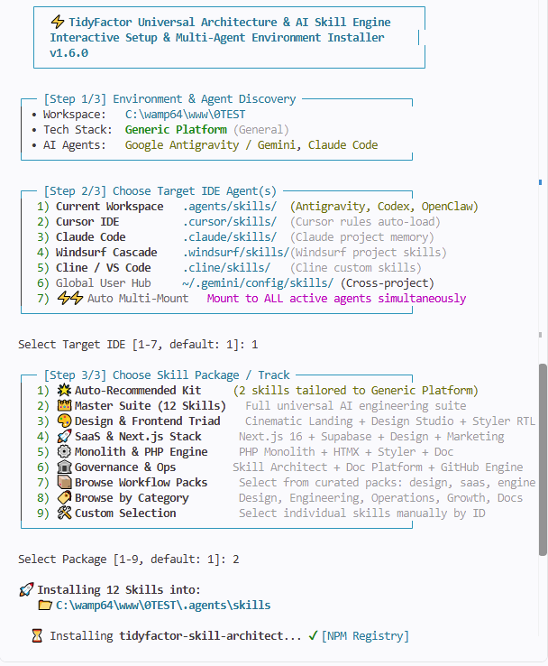
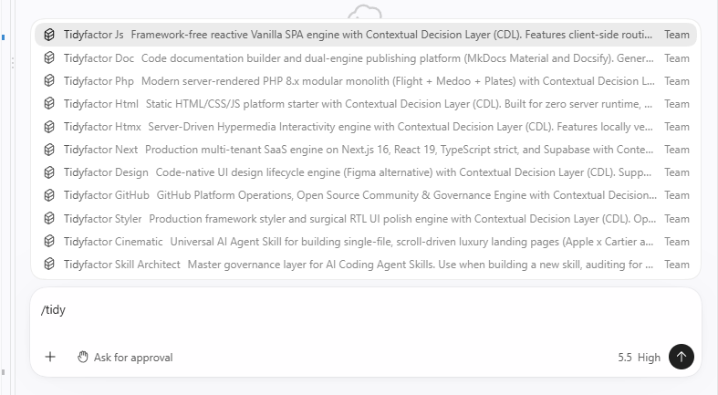

<div align="center">

# ⚡ TidyFactor
### The Operating System for AI-Assisted Software Production
**The unified cognitive kernel, deterministic architectural layer, and developer control plane (`tf`) orchestrating Human-Agent Collaboration across 18+ AI Coding Environments.**

[)](https://www.npmjs.com/package/@tidyfactor/cli)
[](https://github.com/TidyFactor/TidyFactor/releases/latest)
[-emerald.svg?style=for-the-badge&logo=node.js)](package.json)
[](#-the-agent-interoperability-fabric-18-ides)
[](#-the-13-modular-domain-engines)

[-06B6D4.svg?style=for-the-badge)](README.ar.md)
[](#%EF%B8%8F-control-plane-keyboard-shortcuts)
[](LICENSE)
[](https://tidyfactor.com)

[ English ](README.md) • [ العربية ](README.ar.md) • [ فارسی ](README.fa.md) • [ Español ](README.es.md) • [ Português ](README.pt.md) • [ 简体中文 ](README.zh.md) • [ Deutsch ](README.de.md) • [ Français ](README.fr.md)

<br/>

```bash
# Launch the TidyFactor Control Plane across your project
npx @tidyfactor/cli init
# Or install globally to activate the short 'tf' control plane alias
npm install -g @tidyfactor/cli
tf init

# Run any engine ephemerally without installing (stream prompt or launch agent)
tf use design "Build a luxury dark hero section" | claude
```

<br/>

<p align="center">
  
</p>

<p align="center">
  
  
</p>

</div>

---

## 📚 Table of Contents

- [🏛️ Executive Manifesto: The Operating System for AI-Assisted Software Production](#%EF%B8%8F-executive-manifesto-the-operating-system-for-ai-assisted-software-production)
- [🧩 The 6-Layer Architecture of TidyFactor OS](#-the-6-layer-architecture-of-tidyfactor-os)
  - [Layer 1: Cognitive Memory & Governance Kernel (`tidyfactor-brain`)](#layer-1-cognitive-memory--governance-kernel-tidyfactor-brain)
  - [Layer 2: Developer Control Plane (`tf` CLI Engine)](#layer-2-developer-control-plane-tf-cli-engine)
  - [Layer 3: The Architectural Governance Layer (`tidyfactor-skill-architect`)](#layer-3-the-architectural-governance-layer-tidyfactor-skill-architect)
  - [Layer 4: The 13 Modular Domain Capability Engines](#layer-4-the-13-modular-domain-capability-engines)
  - [Layer 5: The Agent Interoperability Fabric (18+ IDEs)](#layer-5-the-agent-interoperability-fabric-18-ides)
  - [Layer 6: Sovereign Multi-Tenant BaaS & Enterprise Cloud](#layer-6-sovereign-multi-tenant-baas--enterprise-cloud)
- [⚡ Quick Multi-Platform Installation (Zero-Lockin)](#-quick-multi-platform-installation-zero-lockin)
  - [1. Universal Node.js Control Plane (`npx` & global `tf`)](#1-universal-nodejs-control-plane-npx--global-tf)
  - [2. Standalone Linux & macOS POSIX Oneliner](#2-standalone-linux--macos-posix-oneliner)
  - [3. Standalone Windows PowerShell Oneliner](#3-standalone-windows-powershell-oneliner)
  - [4. macOS & Linux Homebrew Formula](#4-macos--linux-homebrew-formula)
- [🕹️ Control Plane Keyboard Shortcuts (Interactive TUI)](#%EF%B8%8F-control-plane-keyboard-shortcuts-interactive-tui)
- [📋 Complete Control Plane Command Reference (`tf`)](#-complete-control-plane-command-reference-tf)
  - [1. `tf init` (Project Environment Discovery & Context Binding)](#1-tf-init-project-environment-discovery--context-binding)
  - [2. `tf add <engine|pack>` (Targeted Capability Mounting & Canonical Junctions)](#2-tf-add-enginepack-targeted-capability-mounting--canonical-junctions)
  - [3. `tf use <engine> [prompt]` (Ephemeral Execution Without Installing)](#3-tf-use-engine-prompt-ephemeral-execution-without-installing)
  - [4. `tf find [query]` (Instant Smart Discovery Engine)](#4-tf-find-query-instant-smart-discovery-engine)
  - [5. `tf sync` (Live Active Agent Synchronization)](#5-tf-sync-live-active-agent-synchronization)
  - [6. `tf outdated` & `tf update` (Lifecycle Drift & Upgrades)](#6-tf-outdated--tf-update-lifecycle-drift--upgrades)
  - [7. `tf remove <engine>` (Safe Capability Unmounting)](#7-tf-remove-engine-safe-capability-unmounting)
  - [8. `tf info <engine>` (Architecture Inspection & Triggers)](#8-tf-info-engine-architecture-inspection--triggers)
  - [9. `tf doctor` (Comprehensive Workspace Health Audit)](#9-tf-doctor-comprehensive-workspace-health-audit)
  - [10. `tf whoami` (Sovereign Cloud Identity & Memory Diagnostics)](#10-tf-whoami-sovereign-cloud-identity--memory-diagnostics)
  - [11. `tf packs` & `tf list` (Engine & Catalog Inspection)](#11-tf-packs--tf-list-engine--catalog-inspection)
  - [12. `tf pro` (Enterprise DevOps & PocketOffice Gateway)](#12-tf-pro-enterprise-devops--pocketoffice-gateway)
- [📦 Curated Production Workflow Packs (5 Core Suites)](#-curated-production-workflow-packs-5-core-suites)
- [🏛️ The 13 Modular Domain Capability Engines](#%EF%B8%8F-the-13-modular-domain-capability-engines)
- [🤖 The Agent Interoperability Fabric (18+ IDEs)](#-the-agent-interoperability-fabric-18-ides)
- [🛡️ Governance Lockfile Specification (`.tidyfactor/skills.lock`)](#%EF%B8%8F-governance-lockfile-specification-tidyfactorskillslock)
- [💼 Enterprise Pro Ecosystem & Alwkala Product Foundry](#-enterprise-pro-ecosystem--alwkala-product-foundry)
- [❓ Frequently Asked Questions (FAQ)](#-frequently-asked-questions-faq)
- [👨‍💻 Organization & Official Channels](#-organization--official-channels)
- [📜 License](#-license)

---

## 🏛️ Executive Manifesto: The Operating System for AI-Assisted Software Production

> [!IMPORTANT]
> **Stop thinking of TidyFactor primarily as a collection of AI skills. Think of it as an operating system for AI-assisted software production.**  
> The **TidyFactor CLI (`tf`)** is not merely an npm installer for skills — it is the **Developer Control Plane** orchestrating memory, state, context routing, deterministic rules, and multi-agent execution across your entire codebase.

Artificial Intelligence did not simply make software development faster. It fundamentally transformed **how software is conceptualized, authored, governed, and maintained**. 

Raw, unconstrained LLM code generation inevitably leads to **Architectural Degradation**:
- **Disposable Code vs. Sustainable Systems**: AI produces rapid one-off code blocks that ignore project conventions, creating unmaintainable technical debt.
- **Prompt Drift & Context Amnesia**: LLMs lack continuous memory across sessions, re-inventing basic patterns and forgetting architectural boundaries.
- **The "AI Slop" Trap**: Unvetted generic color palettes, broken directional CSS margins (`mr-*`, `ml-*` breaking RTL), and missing interactive states.
- **Siloed Agent Toolchains**: Cursor, Claude Code, Antigravity, Windsurf, and Copilot operate in isolated silos with inconsistent rules and duplicated configs.

**TidyFactor is the Operating System designed for this new reality.** Just as Unix standardized processes, memory spaces, file descriptors, and a unified shell for computing, **TidyFactor standardizes cognitive memory, architectural contracts, anti-slop quality gates, and a unified Control Plane (`tf`) for AI-assisted software production.**

### 📊 Comparative Analysis: Fragmented AI Codegen vs. TidyFactor OS

| Production Dimension | Raw Prompting & Generic Package Runners | TidyFactor Operating System (`tf`) |
| :--- | :--- | :--- |
| **System Philosophy** | Isolated prompt snippets & compiler packages | **Holistic Operating System for AI-Assisted Software** |
| **Developer Interface** | Chat windows, manual copy-paste, ad-hoc flags | **Unified Control Plane (`tf`) with zero-dep interactive TUI** |
| **Cognitive Memory** | 0% persistent memory; context lost on session reset | **4-Tier Sovereign Memory OS (`Global / Tech / Project / Session`)** |
| **Architectural Governance**| Trusting probabilistic model outputs blindly | **Deterministic Quality Gates (50+ Anti-Slop Rules, 7-Axis Audit)** |
| **Contextual Overhead** | Massive prompt dumps exhausting context windows | **Ultra-lean Dispatchers (~350 tokens) with progressive disclosure** |
| **Multi-Agent Reach** | Manual per-IDE configuration files | **Universal Agent Fabric mounting across 18+ IDEs simultaneously** |
| **State Drift Prevention**| Silent unnoticed drift across code changes | **Sovereign Lockfile (`.tidyfactor/skills.lock`) tracking exact state** |
| **Bilingual Parity** | Fragmented machine translations | **Native First-Class Bilingual Support (Arabic & English `--ar`)** |

---

## 🧩 The 6-Layer Architecture of TidyFactor OS

```mermaid
graph TD
    subgraph Layer6 ["Layer 6: Sovereign BaaS & Enterprise Cloud"]
        CloudDB[Sovereign Dedicated SQLite/Postgres DB]
        BaaSAPI[MCP Stdio/HTTP Cognitive Microservices]
        ProPacks[Enterprise DevOps & PocketOffice Pro Packs]
    end

    subgraph Layer5 ["Layer 5: Multi-Agent Interoperability Fabric (18+ IDEs)"]
        Antigravity[Google Antigravity]
        Cursor[Cursor IDE]
        Windsurf[Windsurf Cascade]
        Claude[Claude Code]
        Trae[Trae AI]
        OtherAgents[Copilot, RooCode, Codex, KiloCode, Warp, Zed...]
    end

    subgraph Layer4 ["Layer 4: Modular Domain Capability Engines (13 Core Tracks)"]
        GovEngines["Governance: Skill-Architect, Brain, GitHub"]
        DesignEngines["Visual/UX: Cinematic, Design, Styler"]
        CoreRuntimes["Core Runtimes: Next.js, PHP Monolith, HTMX, Vanilla JS, Static HTML"]
        DocGrowth["Knowledge: Doc Platform, Marketing & SEO"]
    end

    subgraph Layer3 ["Layer 3: Architectural Governance & Quality Gates"]
        CDL[Contextual Decision Layer CDL v2.0]
        QualityGates[50+ Anti-Slop Matrix & 7-Axis Critique P/H/E/S/R/V/D]
        RuleCatalogs[Prioritized Rule Catalogs & SSOT Contracts]
    end

    subgraph Layer2 ["Layer 2: Developer Control Plane (tf CLI Engine)"]
        CLIControl["⚡ TidyFactor CLI Engine (tf / tidyfactor)"]
        TUI[Zero-Dep Interactive RawMode TUI]
        Lockfile[Governance Lockfile .tidyfactor/skills.lock]
        SyncEngine[Active Agent Auto-Discovery & Sync]
    end

    subgraph Layer1 ["Layer 1: Cognitive Memory & State Kernel"]
        MemoryOS[4-Tier Knowledge Taxonomy: Global / Tech / Project / Session]
        Firewall[Contextual Firewall: Dev Mode vs. Marketing Mode]
        VSS[Gemini Context Caching & Vector Memory Retrieval]
    end

    Layer1 --> Layer2
    Layer2 --> Layer3
    Layer3 --> Layer4
    Layer4 --> Layer5
    Layer5 --> Layer6
```



### Layer 1: Cognitive Memory & Governance Kernel (`tidyfactor-brain`)
The kernel of the OS. It manages persistent state across agent interactions using a **4-Tier Knowledge Taxonomy**:
- **Tier 1 (Global)**: Universal engineering truths, invariant architectural axioms, and cross-project heuristics.
- **Tier 2 (Tech)**: Stack-specific operational memory (Next.js 16 RSC boundaries, PHP 8 modular hooks, HTMX swap invariants).
- **Tier 3 (Project)**: Local workspace briefs (`.tidyfactor/*-brief.md`), design tokens (`brand.yaml`), and project constraints.
- **Tier 4 (Session)**: Ephemeral working memory, scratchpads, and active problem-solving traces.
- **Contextual Firewall**: Strict partition preventing cross-domain context bleed (e.g. keeping backend database security out of marketing copy tasks).

### Layer 2: Developer Control Plane (`tf` CLI Engine)
The developer's cockpit. Far more than a package installer, the Control Plane executes:
- **Environment Telemetry**: Instant AST inspection of package manifests, framework dependencies, and IDE signatures.
- **Interactive TUI**: Arrow-key navigation, live fuzzy search, and spacebar multi-select with zero external dependencies.
- **Lockfile State Governance**: Writes and verifies `.tidyfactor/skills.lock` to maintain strict project reproducibility.
- **Multi-Agent Mounting & Sync**: Detects active agent directories and syncs capabilities across all of them in a single keystroke.
- **Health Diagnostics (`tf doctor`) & Identity Observability (`tf whoami`)**: Full inspection of runtime readiness and cloud brain connectivity.

### Layer 3: The Architectural Governance Layer (`tidyfactor-skill-architect`)
The constitution of the operating system:
- **Contextual Decision Layer (CDL v2.0)**: Thin arbitration protocol resolving unknowns via single-round batching and safe defaults.
- **Anti-Slop Quality Gate Matrix**: 50+ categorical binary prohibitions banning AI tropes (generic purple gradients, unstated low-contrast grays, arbitrary margins).
- **7-Axis Pre-Emit Critique Stamps**: Evaluates all code before delivery across Performance (P), Hygiene (H), Elegance (E), Security (S), RTL/i18n (R), Visual Rigor (V), and Decision Alignment (D).

### Layer 4: The 13 Modular Domain Capability Engines
Thirteen self-contained, deterministic capability tracks covering the full software production lifecycle:
1. **`tidyfactor-skill-architect`** — Master Governance Layer & Methodology Engine.
2. **`tidyfactor-brain`** — Cognitive OS, 4-Tier Memory Governance & Native Stdio MCP Server.
3. **`tidyfactor-github`** — GitHub Platform Operations, Rulesets, SHA-pinned Actions CI & CX Intelligence.
4. **`tidyfactor-cinematic`** — Luxury Scroll-Driven Landing Pages (Apple x Cartier aesthetic) & Canvas Sequences.
5. **`tidyfactor-design`** — Code-Native Interactive Prototyping & Figma Alternative for Design Systems with CDL.
6. **`tidyfactor-styler`** — Production Framework Styler & Surgical RTL Polish Engine (Next.js, PHP, Vanilla).
7. **`tidyfactor-next`** — Multi-Tenant SaaS Engine on Next.js 16, React 19, TypeScript strict, and Supabase RLS.
8. **`tidyfactor-php`** — Modern Server-Rendered PHP 8.x Modular Monolith (Flight + Medoo + Plates) with RBAC.
9. **`tidyfactor-htmx`** — Server-Driven Hypermedia Interactivity Engine paired with PHP, Node, or Python.
10. **`tidyfactor-js`** — Framework-Free Reactive Vanilla SPA with client routing and Proxy state.
11. **`tidyfactor-html`** — 100% Static HTML5 Platform Starter with Web Components and zero server runtime.
12. **`tidyfactor-doc`** — Codebase Documentation Builder & Dual-Engine Publishing (MkDocs Material & Docsify).
13. **`tidyfactor-marketing`** — AI Direct-Response Marketing, Pillar-Cluster SEO & Multi-Channel Growth Engine.

### Layer 5: The Agent Interoperability Fabric (18+ IDEs)
Eliminates proprietary vendor lock-in. A single command equips any IDE:
Google Antigravity, Cursor, Windsurf, Trae, Claude Code, GitHub Copilot, RooCode, OpenCode, KiloCode, Warp, Kiro, Zed, JetBrains AI, Blackbox, Cline, AMP, OpenClaw, and Codex.

### Layer 6: Sovereign Multi-Tenant BaaS & Enterprise Cloud
A secure cloud companion providing:
- Dedicated, private SQLite/PostgreSQL databases per tenant with zero cross-tenant leakage.
- Production MCP services over standard Stdio JSON-RPC 2.0 and HTTP.
- Enterprise DevOps (13 skills) and PocketOffice business automation suites (11 skills).

---

## ⚡ Quick Multi-Platform Installation (Zero-Lockin)

### 1. Universal Node.js Control Plane (`npx` & global `tf`)

Requires standard Node.js (>= 16.0.0). Built with **zero external dependencies** for instant execution:

```bash
# Instant interactive control plane (NPX)
npx @tidyfactor/cli init

# Arabic language interface
npx @tidyfactor/cli init --ar

# Install globally to activate the fast 'tf' command alias
npm install -g @tidyfactor/cli

# Control plane daily workflows
tf init                         # Launch interactive setup & stack detection
tf add pack:design              # Mount curated design triad suite
tf add design --cursor          # Mount design studio specifically into Cursor
tf add brain --all-agents       # Mount cognitive memory across ALL active agents
tf sync                         # Re-synchronize capabilities across all active IDEs
tf outdated                     # Audit installed capabilities for version drift
tf update                       # Upgrade outdated engines while preserving local configs
tf doctor                       # Run comprehensive workspace diagnostics
tf whoami                       # Inspect sovereign cloud tenant quota & firewall state
```

### 2. Standalone Linux & macOS POSIX Oneliner

For cloud CI/CD pipelines, Docker containers, and servers without Node.js:

```bash
# Interactive terminal setup
curl -fsSL https://tidyfactor.com/api/v1/install.sh | bash

# Non-interactive capability mounting
curl -fsSL https://tidyfactor.com/api/v1/install.sh | bash -s -- pack:design
curl -fsSL https://tidyfactor.com/api/v1/install.sh | bash -s -- pack:saas
curl -fsSL https://tidyfactor.com/api/v1/install.sh | bash -s -- tidyfactor-design
curl -fsSL https://tidyfactor.com/api/v1/install.sh | bash -s -- all
```

### 3. Standalone Windows PowerShell Oneliner

Pure ASCII oneliner compatible with Windows PowerShell 5.1 and PowerShell 7+:

```powershell
# Interactive wizard in PowerShell
irm https://tidyfactor.com/api/v1/install.ps1 | iex

# Automated capability mounting
$Skill = 'pack:design'; irm https://tidyfactor.com/api/v1/install.ps1 | iex
$Skill = 'pack:saas'; irm https://tidyfactor.com/api/v1/install.ps1 | iex
$Skill = 'tidyfactor-design'; irm https://tidyfactor.com/api/v1/install.ps1 | iex
$Skill = 'all'; irm https://tidyfactor.com/api/v1/install.ps1 | iex
```

### 4. macOS & Linux Homebrew Formula

```bash
# Install directly from the official master repository:
brew install https://raw.githubusercontent.com/TidyFactor/TidyFactor/main/Formula/tidyfactor.rb

# Or tap the master repository:
brew tap TidyFactor/tidyfactor https://github.com/TidyFactor/TidyFactor.git
brew install tidyfactor
```

---

## 🕹️ Control Plane Keyboard Shortcuts (Interactive TUI)

When operating interactively (`tf init`, `tf add`), the Control Plane activates its native Node.js raw-mode keyboard engine:

| Key / Combination | Control Action | Description |
| :---: | :--- | :--- |
| **`↑` / `↓`** or **`k` / `j`** | **Navigate Pointer** | Move the selection pointer smoothly up and down the list. |
| **`Space` (المسافة)** | **Toggle Selection** | Check or uncheck items in multi-select checkbox menus (`[✔]`). |
| **`a` / `A`** | **Select All** | Instantly select all available engines or agents in the view. |
| **`i` / `I`** | **Invert Selection** | Invert the current selection state of all items. |
| **`[A-Z / a-z / 0-9]`** | **Dynamic Fuzzy Search** | Type any alphanumeric string at any time to filter the list live. |
| **`Backspace`** | **Delete Filter Character** | Remove filter characters and restore broader item visibility. |
| **`Enter` / `Return`** | **Confirm & Proceed** | Commit selected choices and advance to the next step. |
| **`Ctrl + C`** | **Graceful Terminal Exit** | Restore terminal cursor state and exit cleanly without locks. |

---

## 📋 Complete Control Plane Command Reference (`tf`)

### 1. `tf init` (Project Environment Discovery & Context Binding)
Launches the 3-step interactive onboarding process:
- **Step 1: Environment & Agent Telemetry**: Inspects AST packages (`package.json`, `composer.json`, `mkdocs.yml`, `.git`) and detects active coding agents.
- **Step 2: Target Agent Mounting Matrix**: Selects target agent directories (`.agents`, `.cursor`, `.windsurf`, `.trae`, `.claude`, etc.).
- **Step 3: Track Selection**: Matches project stack to recommended engines, curated suites, or custom selections.

```bash
tf init              # Standard English interactive wizard
tf init --ar         # Native Arabic interactive wizard
tf init -y           # Non-interactive silent installation with recommended defaults
tf init --dry-run    # Preview targets and engines without modifying disk
```

### 2. `tf add <engine|pack>` (Targeted Capability Mounting & Canonical Junctions)
Installs a specific engine, curated workflow pack, or the entire 13-engine community suite into chosen agent directories.

> [!TIP]
> **Canonical Junctions Architecture**: When mounting across multiple agents, `tf` installs the canonical files once into `.agents/skills/<skill>` and links secondary agent environments (`.cursor`, `.windsurf`, `.claude`, etc.) via lightweight NTFS Junctions on Windows (no admin rights needed) or directory symlinks on POSIX. Use `--copy` to force independent deep copies.

```bash
# Mount by engine slug
tf add design
tf add tidyfactor-styler
tf add @tidyfactor/brain

# Target specific agent IDE directories
tf add design --cursor                     # Mount to .cursor/skills/
tf add cinematic --windsurf                # Mount to .windsurf/skills/
tf add styler --trae                       # Mount to .trae/skills/
tf add next --copilot                      # Mount to .github/prompts/
tf add skill-architect --global            # Mount globally (~/.gemini/config/skills/)
tf add brain --all-agents                  # Mount to ALL 18+ detected agent platforms

# Mount via specific agent flag (-a, --agent)
tf add design --agent claude-code

# Force deep file copy instead of symlink/junction
tf add design --all-agents --copy

# Mount curated workflow packs
tf add pack:design                         # Design & Frontend Triad
tf add pack:saas                           # SaaS Starter Kit
tf add pack:engineering                    # Full-Stack Engineering

# Mount entire 13-engine master suite
tf add --all
```

### 3. `tf use <engine> [prompt]` (Ephemeral Execution Without Installing)
Executes any skill on-demand without writing permanent files to your repository or altering agent configurations. Perfect for quick one-off tasks, pipeline automation, or clipboard integration.

- **Stdout Streaming**: Without `--agent`, `tf use` streams the clean, fully-formatted markdown prompt directly to `stdout` with zero decorative ANSI noise, enabling effortless shell pipe composition.
- **Interactive Agent Launch**: With `--agent <name>`, `tf use` launches the target AI coding agent interactively with the generated prompt loaded.

```bash
# Stream prompt directly into Claude Code
tf use design "Build a luxury dark hero section" | claude

# Stream prompt into clipboard (Windows clip.exe / macOS pbcopy / Linux xclip)
tf use cinematic "Create scroll animation" | clip.exe
tf use cinematic "Create scroll animation" | pbcopy

# Launch an agent interactively with the skill prompt loaded
tf use design --agent claude-code
tf use styler "Polish RTL Arabic layout" --agent cursor

# Ephemeral execution with Arabic prompt assistance
tf use design "صمم واجهة هبوط داكنة فاخرة" --ar
```

### 4. `tf find [query]` (Instant Smart Discovery Engine)
Instantly searches the TidyFactor ecosystem across all 13 community skills, 5 curated workflow packs, and Pro enterprise suites by keyword, category, or semantic capability.

```bash
# Search by keyword
tf find rtl
tf find database
tf find saas

# Search with Arabic query or results
tf find "واجهة" --ar
tf find "ذاكرة" --ar

# Interactive search mode (prompts for keywords if none provided)
tf find
```

### 5. `tf sync` (Live Active Agent Synchronization)
Scans your workspace for all detected AI coding agent directories (`.cursor`, `.windsurf`, `.trae`, `.agents`, etc.) and automatically synchronizes all currently installed engines into every active agent environment using canonical junctions.

```bash
tf sync              # Synchronize across all active agent workspaces
tf sync --ar         # Execute synchronization with Arabic logging
tf sync --copy       # Synchronize using physical file copies instead of junctions
```

### 6. `tf outdated` & `tf update` (Lifecycle Drift & Upgrades)
Audits installed capability engines against official releases without checking GitHub or NPM manually:

```bash
# Compare installed versions against the official registry
tf outdated

# Upgrade a specific engine to its latest release
tf update design

# Upgrade all installed engines simultaneously
tf update
```

Sample output of `tf outdated`:
```
╭─────────────────────────────┬─────────────┬─────────────┬───────────────────╮
│ Skill                       │ Installed   │ Latest      │ Status            │
├─────────────────────────────┼─────────────┼─────────────┼───────────────────┤
│ tidyfactor-design           │ 1.8.0       │ 1.10.0      │ ⚡ Update Avail.  │
│ tidyfactor-brain            │ 3.0.0       │ 3.0.0       │ ✔ Up to date      │
│ tidyfactor-skill-architect  │ 2.6.0       │ 2.6.0       │ ✔ Up to date      │
╰─────────────────────────────┴─────────────┴─────────────┴───────────────────╯
```

### 7. `tf remove <engine>` (Safe Capability Unmounting)
Safely deletes an engine from all target agent directories and removes its entry from `.tidyfactor/skills.lock`:

```bash
tf remove html
tf remove tidyfactor-htmx
```

### 8. `tf info <engine>` (Architecture Inspection & Triggers)
Displays detailed technical specifications, operational memory architecture, category, description, and slash commands for any engine:

```bash
tf info design
tf info brain
```

### 9. `tf doctor` (Comprehensive Workspace Health Audit)
Performs a deep diagnostic audit of the local environment:
- Node.js runtime version and host platform.
- Workspace root directory.
- Detected frameworks and architectural stack.
- Active agent IDE signatures.
- Lockfile status (`.tidyfactor/skills.lock`).
- Registry endpoint health.

```bash
tf doctor
tf doctor --ar
```

### 10. `tf whoami` (Sovereign Cloud Identity & Memory Diagnostics)
Connects to the TidyFactor Sovereign Cloud Brain via Stdio/HTTP MCP and retrieves tenant quota, vector memory item count, and Contextual Firewall state (`[Dev Mode]` vs `[Marketing Mode]`). Falls back to Local Sovereign Mode if offline.

```bash
tf whoami
```

### 11. `tf packs` & `tf list` (Engine & Catalog Inspection)
Lists all official community engines and workflow packs:

```bash
tf list              # Formatted ASCII table of all 13 engines
tf list --json       # Machine-readable JSON array for CI/CD
tf packs             # Catalog of 5 curated workflow packs
tf packs --json      # Machine-readable JSON catalog
```

### 12. `tf pro` (Enterprise DevOps & PocketOffice Gateway)
Displays information on enterprise DevOps infrastructure engines (13 tracks) and PocketOffice business automation engines (11 tracks), with instructions on license activation:

```bash
tf pro
```

---

## 📦 Curated Production Workflow Packs (5 Core Suites)

| Pack Identifier | Pack Name | Focus & Architectural Scope | Included Capability Engines |
| :--- | :--- | :--- | :--- |
| `pack:design` | **Design & Frontend Triad** | Luxury UI design, scroll-driven cinematic landing pages, surgical RTL styling & governance | `tidyfactor-cinematic`<br/>`tidyfactor-design`<br/>`tidyfactor-styler`<br/>`tidyfactor-skill-architect` |
| `pack:saas` | **SaaS Starter Kit** | Next.js 16 + Supabase multi-tenant stack with UI design, marketing, cognitive memory & documentation | `tidyfactor-next`<br/>`tidyfactor-design`<br/>`tidyfactor-styler`<br/>`tidyfactor-marketing`<br/>`tidyfactor-brain`<br/>`tidyfactor-doc` |
| `pack:engineering` | **Full-Stack Engineering** | Modern server-rendered PHP monolith, HTMX hypermedia, Vanilla SPA & static HTML platforms | `tidyfactor-php`<br/>`tidyfactor-htmx`<br/>`tidyfactor-js`<br/>`tidyfactor-html`<br/>`tidyfactor-doc` |
| `pack:governance` | **Governance & Operations** | Methodology enforcement, 4-tier cognitive memory, documentation AST & GitHub CI operations | `tidyfactor-skill-architect`<br/>`tidyfactor-brain`<br/>`tidyfactor-doc`<br/>`tidyfactor-github` |
| `pack:growth` | **Growth & Marketing** | Direct-response copywriting, pillar-cluster SEO engine, high-converting pages & UI polish | `tidyfactor-marketing`<br/>`tidyfactor-cinematic`<br/>`tidyfactor-styler`<br/>`tidyfactor-html` |

---

## 🏛️ The 13 Modular Domain Capability Engines

Every community engine is open-source (Apache-2.0), self-contained, and follows the **3-Tier Installation Standard**:

| Category | Engine Identifier | Version | Primary Slash Commands | Control Plane Mount Command |
| :--- | :--- | :---: | :--- | :--- |
| **Governance** | `tidyfactor-skill-architect` | `v2.6.0` | `/init`, `/audit`, `/test`, `/grow`, `/brief`, `/learn` | `tf add skill-architect` |
| **Governance** | `tidyfactor-brain` | `v3.0.0` | `/brief`, `/context`, `/switch`, `/hygiene`, `/recall`, `/firewall` | `tf add brain` |
| **Operations** | `tidyfactor-github` | `v1.3.1` | `/audit`, `/oss`, `/ruleset`, `/readme`, `/release`, `/security` | `tf add github` |
| **Design** | `tidyfactor-cinematic` | `v3.6.0` | `/film`, `/brand`, `/hero`, `/theme`, `/perf`, `/brief` | `tf add cinematic` |
| **Design** | `tidyfactor-design` | `v1.10.0` | `/study`, `/brief`, `/tokens`, `/palette`, `/layout`, `/dashboard` | `tf add design` |
| **Design** | `tidyfactor-styler` | `v1.4.0` | `/component`, `/section`, `/redesign`, `/rtl`, `/motion`, `/brief` | `tf add styler` |
| **Engineering** | `tidyfactor-next` | `v1.4.0` | `/brief`, `/init`, `/tenant`, `/rls`, `/auth`, `/api` | `tf add next` |
| **Engineering** | `tidyfactor-php` | `v1.2.0` | `/brief`, `/init`, `/admin`, `/plugins`, `/themes`, `/rbac` | `tf add php` |
| **Engineering** | `tidyfactor-htmx` | `v1.2.0` | `/brief`, `/init`, `/fragments`, `/swap`, `/triggers`, `/forms` | `tf add htmx` |
| **Engineering** | `tidyfactor-js` | `v1.2.0` | `/brief`, `/init`, `/store`, `/compo`, `/route`, `/pages` | `tf add js` |
| **Engineering** | `tidyfactor-html` | `v1.2.0` | `/brief`, `/init`, `/compo`, `/pages`, `/assets`, `/seo` | `tf add html` |
| **Documentation** | `tidyfactor-doc` | `v1.5.0` | `/init`, `/collect`, `/generate`, `/site`, `/mkdocs`, `/docsify` | `tf add doc` |
| **Growth** | `tidyfactor-marketing` | `v1.5.0` | `/strategy`, `/content`, `/social`, `/email`, `/advertising`, `/brief` | `tf add marketing` |

> 💡 **Mount Full Master Suite (All 13 Engines)**: `tf add --all`  
> *(For air-gapped or offline enterprise environments without Node.js, standalone `.skill` binaries remain accessible via [GitHub Releases](https://github.com/TidyFactor/TidyFactor/releases/latest)).*

---

## 🤖 The Agent Interoperability Fabric (18+ IDEs)

The Control Plane automatically discovers and mounts capability engines into the correct project directories for all mainstream agent environments:

| # | AI Agent / IDE Platform | Project Mount Directory | Detection Signatures | Primary Interaction Model |
| :-: | :--- | :--- | :--- | :--- |
| **1** | **Universal Default** | `.agents/skills/<skill>/` | Universal fallback root | Automatic workspace discovery |
| **2** | **Google Antigravity / Gemini** | `.agents/skills/<skill>/` | `.agents`, `GEMINI.md` | Injected skills & Context Caching |
| **3** | **Cursor IDE** | `.cursor/skills/<skill>/` | `.cursor`, `.cursorrules` | Project rules & command resolution |
| **4** | **Windsurf Cascade** | `.windsurf/skills/<skill>/` | `.windsurf`, `.windsurfrules` | Cascade workspace tools & rules |
| **5** | **Trae AI IDE** | `.trae/skills/<skill>/` | `.trae`, `.traerules` | ByteDance Trae agentic workflows |
| **6** | **Claude Code** | `.claude/skills/<skill>/` | `.claude`, `CLAUDE.md` | Command & memory context injection |
| **7** | **GitHub Copilot** | `.github/prompts/<skill>/` | `.github/copilot-instructions.md` | Copilot workspace prompts |
| **8** | **RooCode (Roo Cline)** | `.roo/skills/<skill>/` | `.roo`, `.roomodes`, `.roo/rules` | Mode-specific system instructions |
| **9** | **OpenCode / Zen** | `.opencode/skills/<skill>/` | `.opencode`, `opencode.json` | OpenCode agent definitions |
| **10**| **KiloCode** | `.kilocode/skills/<skill>/` | `.kilocode`, `kilo.jsonc` | Kilo task engine steering |
| **11**| **Warp Terminal** | `.warp/skills/<skill>/` | `.warp`, `.warp/workflows` | Warp agentic terminal workflows |
| **12**| **Kiro (AWS Spec IDE)** | `.kiro/skills/<skill>/` | `.kiro`, `.kiro/steering` | AWS spec steering context |
| **13**| **Zed AI Agent** | `.zed/skills/<skill>/` | `.zed`, `.zed/settings.json` | Zed assistant rules |
| **14**| **JetBrains AI** | `.jetbrains/skills/<skill>/` | `.idea`, `.idea/ai` | Junie / PyCharm / IDEA agent rules |
| **15**| **Blackbox AI** | `.blackbox/skills/<skill>/` | `.blackbox`, `.blackboxrules` | Blackbox autonomous prompts |
| **16**| **Cline / VS Code** | `.cline/skills/<skill>/` | `.clinerules`, `.cline` | Custom toolchain integration |
| **17**| **AMP AI** | `.amp/skills/<skill>/` | `.amprules`, `.amp` | AMP system memory |
| **18**| **OpenClaw** | `.openclaw/skills/<skill>/` | `.openclaw`, `.clawdbot` | OpenClaw bot memory |
| **19**| **OpenAI Codex** | `.agents/skills/<skill>/` | `codex.md`, `AGENTS.md` | Global instructions & memory |
| **20**| **Global User Hub** | `~/.gemini/config/skills/` | Universal OS User Home | Available across all projects globally |

---

## 🛡️ Governance Lockfile Specification (`.tidyfactor/skills.lock`)

To guarantee reproducible human-agent collaboration and prevent undocumented prompt drift, TidyFactor OS codifies the **Skill Lockfile Standard**:

### Example `.tidyfactor/skills.lock`
```json
{
  "lockfile_version": "1.0.0",
  "generator": "@tidyfactor/cli@2.0.0",
  "updated_at": "2026-09-05T14:30:00.000Z",
  "skills": {
    "tidyfactor-design": {
      "version": "1.10.0",
      "source": "local",
      "installed_at": "2026-09-05T14:30:00.000Z",
      "targets": [
        ".agents/skills/tidyfactor-design",
        ".cursor/skills/tidyfactor-design"
      ]
    },
    "tidyfactor-brain": {
      "version": "3.0.0",
      "source": "cdn",
      "installed_at": "2026-09-05T14:30:00.000Z",
      "targets": [
        ".agents/skills/tidyfactor-brain"
      ]
    }
  }
}
```

### Invariants & Security Guarantees
1. **Zip Slip Prevention**: Every entry path in extracted archives is strictly checked to ensure it cannot resolve outside the intended target folder.
2. **Atomic Staging Swapping**: Extraction uncompresses into an isolated temporary folder (`os.tmpdir()/tf_stage_*`), validates the existence of `SKILL.md`, and only moves files to the final destination upon 100% verification.
3. **Fail-Open Workstation Fallback**: If network connectivity to NPM or CDN is interrupted, the Control Plane automatically falls back to local fast-sync or offline cache without blocking the developer.

---

## 💼 Enterprise Pro Ecosystem & Alwkala Product Foundry

TidyFactor maintains a strict separation between **Open Architecture Standards** and **Commercial Implementations**:

- **Pure Intelligence & Context Layer Doctrine**: TidyFactor is strictly the neutral Operating System (`Kernel + Memory + Governance + Control Plane + Open Community Engines`).
- **Alwkala (الوكالة)**: Operates as the regional digital agency and product foundry building client implementations, web platforms, and templates *powered by* TidyFactor.
- **Enterprise Pro Suites (`tf pro`)**:
  - **DevOps Pro (13 Skills)**: `ops-cpanel`, `ops-lamp`, `ops-cicd`, `ops-docker`, `ops-security`, `ops-db`, `ops-dns`, `ops-dr`, `ops-local-dev`, `ops-mail`, `ops-node`, `ops-testing`, `ops-wp`.
  - **PocketOffice Pro (11 Skills)**: `pocket-crm`, `pocket-invoicing`, `pocket-finance`, `pocket-proposals`, `pocket-calendar`, `pocket-marketing`, `pocket-kb-manager`, `pocket-memory`, `pocket-module-builder`, `pocket-release`.
  - **MENA Growth Pro**: `tidyfactor-seo`, `mena-proposal-writer`, `website-copywriting-mena`.

---

## ❓ Frequently Asked Questions (FAQ)

<details>
<summary><b>Q1: Is TidyFactor just a prompt repository or a collection of markdown files?</b></summary>
No. TidyFactor is an operating system for AI-assisted software production. While skills contain dispatchers, they encapsulate AST linters, execution scripts, Contextual Decision Layer (CDL) contracts, deterministic quality gates, and persistent cognitive memory.
</details>

<details>
<summary><b>Q2: What is the role of the TidyFactor CLI (tf)?</b></summary>
The CLI is the <b>Developer Control Plane</b>. It orchestrates environment discovery, mounts capabilities across 18+ agent environments, enforces lockfile governance (<code>skills.lock</code>), synchronizes workspaces, and connects to the sovereign cloud memory.
</details>

<details>
<summary><b>Q3: Does TidyFactor require external npm dependencies?</b></summary>
No. The Control Plane has <b>zero external npm dependencies</b>. Everything—including the interactive arrow-key TUI, real-time filtering, download progress bar, and archive extraction—is built using native Node.js core modules.
</details>

<details>
<summary><b>Q4: How do AI agents recognize the mounted capability engines?</b></summary>
When mounted into an agent's directory (e.g., <code>.cursor/skills/</code> or <code>.agents/skills/</code>), the agent reads the engine's <code>SKILL.md</code> dispatcher and registers its slash commands (like <code>/brief</code>, <code>/tokens</code>, <code>/component</code>) automatically into chat autocomplete.
</details>

<details>
<summary><b>Q5: How do I switch the Control Plane to Arabic?</b></summary>
Pass the <code>--ar</code> flag to any command (e.g., <code>tf init --ar</code> or <code>tf doctor --ar</code>), or set the environment variable <code>export TIDYFACTOR_LANG="ar"</code>.
</details>

<details>
<summary><b>Q6: Will upgrading an engine overwrite my custom project settings?</b></summary>
No. TidyFactor engines adhere to the <i>Contextual Decision Layer (CDL)</i> standard. Your local project brief (<code>.tidyfactor/*-brief.md</code>) and design tokens (<code>brand.yaml</code>) live outside the skill directory and remain untouched during upgrades.
</details>

---

## 👨‍💻 Organization & Official Channels

- 🌐 **Official Website:** [https://tidyfactor.com/](https://tidyfactor.com/)
- 📚 **Documentation Platform:** [https://tidyfactor.com/documentation](https://tidyfactor.com/documentation)
- 🤝 **Product Foundry & Partner:** [Alwkala Digital Agency (الوكالة)](https://alwkala.com/)
- 🐙 **GitHub Organization:** [github.com/TidyFactor](https://github.com/TidyFactor)
- 📦 **NPM Registry:** [@tidyfactor/cli on NPM](https://www.npmjs.com/package/@tidyfactor/cli)
- 📧 **Business Inquiries:** [hello@tidyfactor.com](mailto:hello@tidyfactor.com)
- 📱 **WhatsApp:** [+20 101 665 6899](https://wa.me/201016656899)
- 📍 **Location:** Cairo, Egypt 🇪🇬

---

## 📜 License

Distributed under the **Apache License 2.0**. Copyright (c) 2026 [TidyFactor](https://tidyfactor.com) & [Alwkala Digital Agency](https://alwkala.com).
