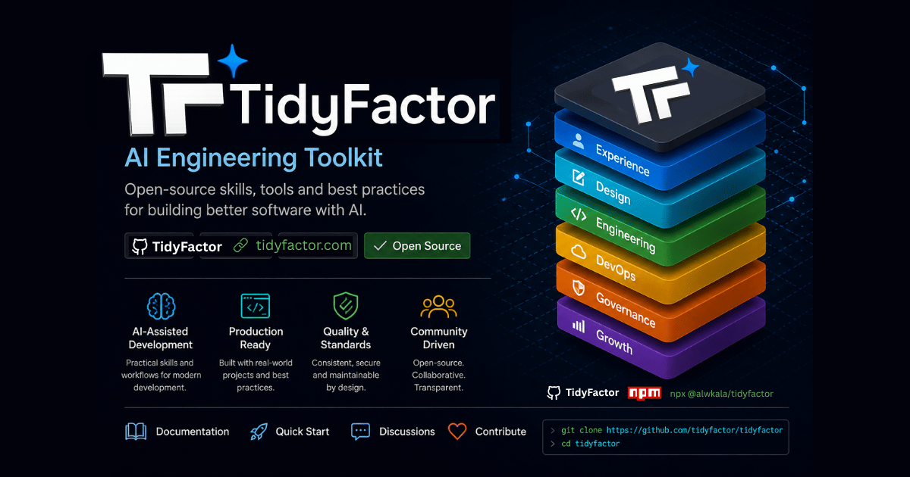

<div align="center">

# ⚡ Ecossistema Arquitetural TidyFactor
### Arquitetura Web Nativa para IA, Sistemas de Design e Habilidades para Agentes

**Construindo software sustentável, determinístico e modular para a era da colaboração Humano-Agente.**

[](https://tidyfactor.com)
[](https://tidyfactor.com/documentation)
[](https://www.npmjs.com/org/tidyfactor)
[](LICENSE)
[](https://tidyfactor.com)

[ English ](README.md) • [ العربية ](README.ar.md) • [ فارسی ](README.fa.md) • [ Español ](README.es.md) • [ Português ](README.pt.md) • [ 简体中文 ](README.zh.md) • [ Deutsch ](README.de.md) • [ Français ](README.fr.md)

<br/><br/>

<p align="center">
  
</p>

</div>

---

## 🌟 Por que o TidyFactor existe

A web mudou. A Inteligência Artificial transformou fundamentalmente a maneira como o software é construído, compreendido e mantido.

---

## 🏛️ Ecosystem Architecture (13 Official Skills)

```
TidyFactor Organization (github.com/TidyFactor)
│
├── 🏛️ Governance & Memory
│   ├── Skill-Architect → Master Governance  (15 Structural Rules, CDL v2.0 & Quality Gate)
│   ├── Brain           → Cognitive Memory OS(4-Tier Memory, Sovereign Switcher & MCP Server)
│   └── GitHub          → Platform Intel     (Platform Operations, Rulesets, Actions CI & CX Engine)
│
├── 🎨 Design Skills
│   ├── Cinematic       → Experience / "Wow" (Scroll-Driven Landing Pages Animations)
│   ├── Design          → Prototype / "Build"(Code-Native UI Design Engine & Figma Alternative)
│   └── Styler          → Production / "Ship"(Framework Styler & RTL Polish Engine)
│
├── ⚡ Core Engineering & Development Skills
│   ├── HTML            → Static Platform    (Semantic SEO & 100/100 Lighthouse Starter)
│   ├── HTMX            → Hypermedia         (Server-Driven Micro-Interactions)
│   ├── JS              → Vanilla SPA        (Framework-Free Reactive ES Modules)
│   ├── PHP             → Server-Rendered    (Modern PHP 8.x Component Monolith)
│   └── Next            → Multi-Tenant SaaS  (Next.js 16, React 19, Supabase RLS & Dev-Perf)
│
├── 📚 Documentation Skills
│   └── Doc             → AST Engine         (Codebase Interview, Living Docs & Docsify Builder)
│
└── 📈 Growth Skills
    └── Marketing       → Direct Response    (Campaigns, Pillar SEO & Content Lifecycles)
```

---

## 💎 A Tríade de Frontend

* **Cinematic (`TidyFactor/Cinematic`)**: Luxury scroll-driven `<canvas>` frame sequence experience.
* **Design (`TidyFactor/Design`)**: Interactive code-native UI design lifecycle engine and Figma alternative.
* **Styler (`TidyFactor/Styler`)**: Surgical production framework styler and RTL UI polish engine.

---

## 📦 Skills Matrix & Mount Commands

| Category | Skill Identifier | Control Plane Mount Command |
| :--- | :--- | :--- |
| **Governance** | `tidyfactor-skill-architect` | `tf add skill-architect` |
| **Governance** | `tidyfactor-brain` | `tf add brain` |
| **Operations** | `tidyfactor-github` | `tf add github` |
| **Design** | `tidyfactor-cinematic` | `tf add cinematic` |
| **Design** | `tidyfactor-design` | `tf add design` |
| **Design** | `tidyfactor-styler` | `tf add styler` |
| **Engineering** | `tidyfactor-html` | `tf add html` |
| **Engineering** | `tidyfactor-next` | `tf add next` |
| **Engineering** | `tidyfactor-htmx` | `tf add htmx` |
| **Engineering** | `tidyfactor-js` | `tf add js` |
| **Engineering** | `tidyfactor-php` | `tf add php` |
| **Documentation** | `tidyfactor-doc` | `tf add doc` |
| **Growth** | `tidyfactor-marketing` | `tf add marketing` |

> 💡 **Mount Full Master Suite (All 13 Engines)**: `tf add --all`  
> *(For air-gapped or offline enterprise environments without Node.js, standalone `.skill` binaries remain accessible via [GitHub Releases](https://github.com/TidyFactor/TidyFactor/releases/latest)).*

---

## 🏛️ Princípios Arquiteturais Fundamentais

1. **Context-Efficient Architecture**: Agent skills use lightweight dispatchers (~350 tokens) with progressive disclosure.
2. **Deterministic Execution**: Zero autonomous mass-edit scripts. Toolchains wrap native diagnostics (`tsc`, `node`, `git`, OS APIs).
3. **Locked Tenant Isolation**: Security boundaries live at the database layer (PostgreSQL RLS).
4. **Evidence-Based Performance**: Measure before optimizing. Cold/warm benchmark separation with a 20% noise threshold.
5. **Human-Agent Code Symmetry**: Code structured for instant comprehension by human engineers and AI coding agents.

---

## 👨‍💻 Organização e Suporte

- 🌐 **Official Website:** [https://tidyfactor.com/](https://tidyfactor.com/)
- 📚 **Official Documentation:** [https://tidyfactor.com/documentation](https://tidyfactor.com/documentation)
- 🤝 **Official Partner Website:** [Alwkala Digital Agency](https://alwkala.com/)
- 🐙 **GitHub Organization:** [github.com/TidyFactor](https://github.com/TidyFactor)
- 📧 **Business Inquiries:** [hello@tidyfactor.com](mailto:hello@tidyfactor.com)
- 📱 **WhatsApp:** [+20 101 665 6899](https://wa.me/201016656899)
- 📞 **Phone:** +20 101 665 6899
- 📍 **Location:** Cairo, Egypt

---

## 📜 Licença

Distributed under the **Apache License 2.0**. Copyright (c) 2026 [TidyFactor](https://tidyfactor.com) & [Alwkala Digital Agency](https://alwkala.com).
