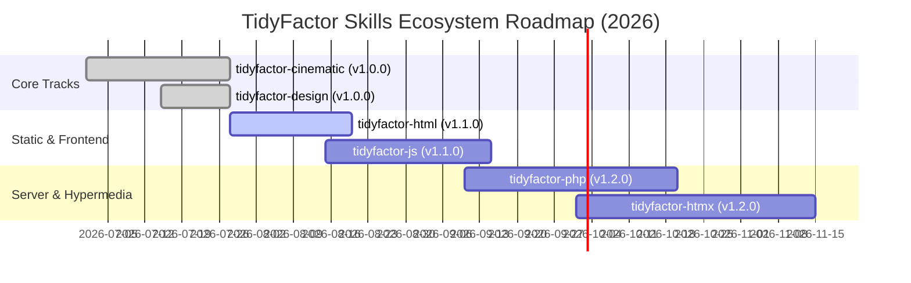

# TidyFactor Skills Ecosystem — Master Development & Publishing Roadmap (2026–2027)

> **Single Source of Truth Strategic Roadmap** for developing, maintaining, validating, packaging, and publishing the full suite of AI-native Agent Skills within the **TidyFactor Ecosystem**.

---

## 🏛️ Executive Summary & Core Principles

The **TidyFactor Skills Ecosystem** provides modular, AI-native development capabilities for autonomous coding agents (Google Antigravity, Claude Code, Cursor, Windsurf, Roo Code, Cline) and human developers.

Every skill is designed around **three core invariants**:
1. **Single Source of Truth (SSOT)**: Source code, documentation, templates, and agent rules reside exclusively in `c:\wamp64\www\TidyFactor\Skills\Skills-LAB\<skill-name>\`.
2. **100% Naming & Packaging Parity**:
   - Skill folder: `<skill-name>` (e.g., `tidyfactor-design`, `tidyfactor-cinematic`)
   - Archive bundle: `<skill-name>.skill` in `Skills-LAB` root
   - NPM Package: `@alwkala/<skill-name>`
   - CLI Executable: `npx @alwkala/<skill-name>` or `npx <skill-name>`
   - Skill Injection: `npx @alwkala/<skill-name> add-skill` or `npx <skill-name> add-skill`
3. **Zero Build Dependencies for Scaffolding**: CLI binaries use pure Node.js standard libraries for instant non-interactive CI/CD and AI agent execution.

---

## 🗺️ Master Skill Matrix & Release Status

| Skill Track | Purpose & Scope | Slash Commands | Foundational Stack | NPM Package | Target Release | Status |
| :--- | :--- | :---: | :--- | :--- | :---: | :---: |
| **`tidyfactor-skill-architect`** | Governance layer & skill methodology engine | 3 | Dispatcher, Spec, Growth Rules, Tooling | [`@alwkala/tidyfactor-skill-architect`](https://www.npmjs.com/package/@alwkala/tidyfactor-skill-architect) | **v1.0.0** (Aug 2026) | 🟢 Production Ready |
| **`tidyfactor-cinematic`** | Luxury scroll-driven landing pages & dynamic motion showcases | 17 | Three.js, GSAP, WebGL, Tailwind | [`@alwkala/tidyfactor-cinematic`](https://www.npmjs.com/package/@alwkala/tidyfactor-cinematic) | **v1.0.0** (Jul 2026) | 🟢 Production Ready |
| **`tidyfactor-design`** | Code-native interactive prototyping engine & design systems | 15 | Native CSS, Tailwind, daisyUI, Hybrid | [`@alwkala/tidyfactor-design`](https://www.npmjs.com/package/@alwkala/tidyfactor-design) | **v1.0.0** (Jul 2026) | 🟢 Production Ready |
| **`tidyfactor-marketing`** | AI direct-response marketing & 360° growth engine | 28 | Direct Response, SEO, B2B LinkedIn, CRO | [`@alwkala/tidyfactor-marketing`](https://www.npmjs.com/package/@alwkala/tidyfactor-marketing) | **v1.0.0** (Aug 2026) | 🟢 Production Ready |
| **`tidyfactor-next`** | Production-grade Next.js 16 & SaaS architecture & dev-perf engine | 14 | Next.js 16, React 19, Supabase RLS, Dev-Perf | [`@alwkala/tidyfactor-next`](https://www.npmjs.com/package/@alwkala/tidyfactor-next) | **v1.0.0** (Aug 2026) | 🟢 Production Ready |
| **`tidyfactor-doc`** | Code documentation builder & Docsify architecture engine | 4 | Markdown, Docsify, PHPDoc, JSDoc | [`@alwkala/tidyfactor-doc`](https://www.npmjs.com/package/@alwkala/tidyfactor-doc) | **v1.1.0** (Aug 2026) | 🟢 Production Ready |
| **`tidyfactor-styler`** | Codebase UI designer & RTL typography engine | 15 | Vanilla CSS, Logical Properties, Tailwind | [`@alwkala/tidyfactor-styler`](https://www.npmjs.com/package/@alwkala/tidyfactor-styler) | **v1.0.0** (Aug 2026) | 🟢 Production Ready |
| **`tidyfactor-html`** | Content-first static web platforms & semantic SEO foundations | 12 | Semantic HTML5, Vanilla CSS, JSON metadata | [`@alwkala/tidyfactor-html`](https://www.npmjs.com/package/@alwkala/tidyfactor-html) | **v1.1.0** (Aug 2026) | 🟡 Active Dev |
| **`tidyfactor-js`** | Framework-free single-page applications & micro-apps | 14 | Vanilla JS ES Modules, Router, Store | [`@alwkala/tidyfactor-js`](https://www.npmjs.com/package/@alwkala/tidyfactor-js) | **v1.1.0** (Sep 2026) | 🟡 Active Dev |
| **`tidyfactor-php`** | Full-stack server-rendered web applications & component layouts | 12 | PHP 8.x, Flight, Medoo, Plates, SQLite | [`@alwkala/tidyfactor-php`](https://www.npmjs.com/package/@alwkala/tidyfactor-php) | **v1.2.0** (Oct 2026) | 🔵 Planned |
| **`tidyfactor-php-kernel`** | Domain-agnostic modular monolith kernel & module registry | 10 | Flight, Medoo, Modular Monolith, Kernel API | [`@alwkala/tidyfactor-php-kernel`](https://www.npmjs.com/package/@alwkala/tidyfactor-php-kernel) | **v1.0.0** (Aug 2026) | 🟢 Production Ready |
| **`tidyfactor-htmx`** | Server-driven hypermedia interactivity & dynamic UI updates | 10 | htmx, Server Endpoints, Micro-HTML | [`@alwkala/tidyfactor-htmx`](https://www.npmjs.com/package/@alwkala/tidyfactor-htmx) | **v1.2.0** (Nov 2026) | 🔵 Planned |


---

## 📅 Roadmap Schedule & Development Phases



---

## 🏗️ Standardized Skill Anatomy

Every skill repository inside `Skills-LAB` adheres strictly to this folder anatomy:

```
c:\wamp64\www\TidyFactor\Skills\Skills-LAB\<skill-name>\
├── AGENTS.md                          ← Workspace rules & token routing
├── VISION.md                          ← Pointer to ../TidyFactor-VISION.md
├── SKILL-REGISTRY.md                  ← Identity, commands, foundations & metadata
├── .tidyfactor                        ← JSON metadata marker
├── brand.json                         ← Brand token defaults
├── package.json                       ← NPM package configuration (@alwkala/<skill-name>)
├── README.md & README.ar.md           ← English & Arabic documentation
├── CHANGELOG.md & LICENSE             ← Release history & MIT license
├── .agents/skills/<skill-name>/       ← Antigravity wrapper (SKILL.md + references/commands/)
├── .claude-skill/                     ← Claude Code / Cursor / Windsurf wrapper
├── memory/                            ← Lazy-loaded deep reference memory files
├── templates/                         ← Starter project templates and layouts
├── scripts/                           ← Python media processing tools (if applicable)
├── bin/                               ← CLI binaries (create-kit.js & add-skill.js)
├── tools/                             ← Validation (validate-skill.js) & Builder (build-skill.js)
└── .github/workflows/                 ← GitHub & NPM Release workflow (release.yml)
```

---

## 🚀 Publishing Pipeline & Release Workflow

### 1. Automated Validation & Packaging Protocol
Before publishing any release:
```bash
# Run full validation and sync cross-agent targets
npm run validate

# Package archive and auto-sync to Skills-LAB root (<skill-name>.skill)
npm run build:all
```

### 2. GitHub Tag & NPM Release
```bash
git tag v1.0.0
git push origin v1.0.0
```
The automated `.github/workflows/release.yml` workflow performs:
1. Automated execution of `node tools/validate-skill.js`.
2. Building `dist/<skill-name>.skill`.
3. Creating a GitHub Release with attached `.skill` binary asset.
4. Publishing public release package to NPM under `@alwkala/<skill-name>`.

---

## 🔄 Cross-Skill Synergy & Interoperability

The TidyFactor ecosystem is modular and non-intrusive:
- **`tidyfactor-design`** builds interactive code-native prototypes. Once approved, the prototype can be transformed into a production static site via **`tidyfactor-html`**, a framework-free SPA via **`tidyfactor-js`**, or a server-rendered application via **`tidyfactor-php`** and **`tidyfactor-htmx`**.
- All tracks share the unified **`brand.json`** schema and token structure, allowing brand design systems to move seamlessly across technology stacks without redesign.

---

*Maintained by [Alwkala](https://alwkala.com) for the TidyFactor Ecosystem.*
